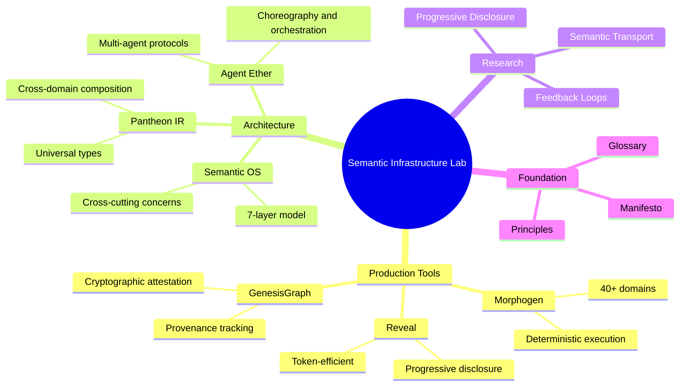

# Welcome to the Semantic Infrastructure Lab

**Start Here** — The single front door to SIL

> **Quick Links:**
> - [FAQ](/meta/faq) — Common questions answered
> - [Glossary](/canonical/glossary) — Terms and definitions

---

## SIL at a Glance

---

## What is SIL?

SIL is a **Semantic Operating System** — a new substrate for meaning, memory, and structured reasoning.

Just as UNIX provided an operating system for computation, SIL provides an operating system for semantics: a stable foundation where representations are explicit, transformations are traceable, and reasoning is inspectable.

## Why Does SIL Exist?

Today's AI systems are powerful but structurally incomplete.

They lack:
- **Stable semantic structure** — meaning drifts, representations are opaque
- **Provenance** — you can't trace how conclusions were reached
- **Deterministic reasoning** — the same input produces different outputs
- **Cross-domain coherence** — every domain builds its own isolated infrastructure

SIL builds the missing layer: **semantic infrastructure** that makes meaning explicit, transformations auditable, and reasoning reliable.

## What Has SIL Built?

SIL is not a vision document. It's working infrastructure:

### Core Architecture
- **7-Layer Semantic OS** — From semantic memory through agent orchestration
- **Pantheon IR** — Universal typed semantic IR (Intermediate Representation)
- **GenesisGraph** — Cryptographically verifiable provenance with selective disclosure
- **Morphogen** — Cross-domain unified primitives (40+ computational domains)

### Production Tools
- **Reveal** (v0.24.0) — Progressive disclosure for code structure & Python runtime inspection
  - `pip install reveal-cli`
  - 86% token reduction for agent workflows
  - New: `python://` adapter for runtime environment analysis
  - AST-based (Abstract Syntax Tree), correct, composable

- **Agent Help Standard** — Strategic guidance for AI agents using CLI tools
- **Philbrick** — Modular analog/digital hybrid computing substrate

### Philosophical Foundation
- **Technical Charter** — Formal invariants and guarantees
- **Principles** — 14 foundational constraints (structure before heuristics, provenance everywhere, meaning must be explicit)
- **Manifesto** — Why semantic infrastructure matters

## What Makes SIL Different?

Most AI labs build **applications on top of opaque models**.
SIL builds **the semantic substrate beneath them**.

This is the difference between:
- Building apps in the 1960s
- Building the OS, file system, and memory model that every future app relies on

### Core Commitments

**Structure Before Heuristics**
SIL prioritizes explicit structure over statistical inference. Structure decides, heuristics only propose.

**Provenance Everywhere**
Every transformation produces a provenance record. No silent changes.

**Determinism When Promised**
If an operation claims to be deterministic, the system ensures it.

**Meaning Must Be Explicit**
Every meaningful object must be represented as a typed, inspectable semantic structure.

**Long-Lived Artifacts**
SIL builds infrastructure meant to last decades, not chase quarterly trends.

## Where to Go Next

### For the Story
**[Founder's Letter](/canonical/founders-letter)** — Why SIL was built, the vision, and what we're inviting you to help build

### For the Personal Vision
**[Founder Background](/meta/founder-background)** — Working systems, production metrics, and track record
**[Influences & Acknowledgments](/meta/influences-and-acknowledgments)** — The thinkers and traditions that shaped SIL

### For the Philosophy
**[Manifesto](/canonical/manifesto)** — The philosophical foundation
**[Principles](/canonical/principles)** — 14 foundational constraints that define SIL

### For the Technical Depth
**[Technical Charter](/canonical/technical-charter)** — Formal specification with invariants and guarantees
**[Semantic OS Architecture](/canonical/semantic-os-architecture)** — 7-layer architecture from memory to interfaces

### For the Tools
**[Reveal](/tools/reveal)** — Code structure navigation
**[Agent Help Standard](/research/agent-help-standard)** — Strategic guidance for agents
**[GenesisGraph](https://github.com/Semantic-Infrastructure-Lab/genesisgraph)** — Verifiable provenance
**[Morphogen](/innovations/morphogen)** — Unified computational substrate

### For Collaborators
**[FAQ](/meta/faq)** — Common questions answered
**[GitHub](https://github.com/Semantic-Infrastructure-Lab)** — How to join us

## The Bell Labs of AI

SIL stands in the lineage of foundational systems work — not building products, but building the substrate that makes future systems possible.

**Built by one person** over two years, inspired by:
- **Alan Turing** — computation, emergence, morphogenesis
- **K&R + UNIX** — clarity, composability, simplicity as power

This is infrastructure work. Long-term work. Work that matters.

If this resonates with you — **welcome**.

---

**Semantic Infrastructure Lab**
Building the semantic substrate for the next generation of human-machine reasoning.

[Email](mailto:scott@semanticinfrastructurelab.org) | [GitHub](https://github.com/Semantic-Infrastructure-Lab) | [Website](https://semanticinfrastructurelab.org)
