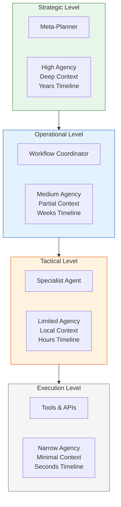

# The Hierarchy of Agency
## A Unified Framework for Human and Artificial Systems

**Author:** Scott Senkeresty (integration: Claude/TIA)
**Date:** 2025-12-04
**Status:** Canonical
**Related:** MULTI_AGENT_PROTOCOL_PRINCIPLES.md (companion document)

---

## Abstract

Agency is not a monolithic property—it is **stratified**. Human organizations, biological systems, and emerging agentic AI architectures all function through a gradient of autonomy in which each layer operates with different information, authority, time horizons, and risk profiles.

This document synthesizes organizational theory, mission command doctrine, and modern AI design into a unified model of **hierarchical agency**. We show how selective sharing of "why," structured rule-bending authority, and calibrated autonomy preserve coherence while enabling adaptation. Finally, we map these principles onto a multi-level AI architecture designed to avoid common pitfalls of contemporary autonomous systems.

**Core Thesis:** Well-designed systems have a **smooth gradient of agency** from strategic (high autonomy, deep context) to execution (zero autonomy, minimal context). This gradient is not a limitation—it is a design feature that prevents catastrophic misalignment.

**Relationship to SIL Protocols:**
- **This document** defines the **vertical structure** (how agents at different levels interact)
- **MULTI_AGENT_PROTOCOL_PRINCIPLES.md** defines the **horizontal structure** (how agents at the same level coordinate)
- Together, they form a complete multi-agent architecture



---

## 1. Agency Is Not Uniform—It Is Calibrated by Level

Complex systems operate because agency is *differentiated*. Each layer in a hierarchy works with its own:

* **Time horizon** - Strategic thinks in years; execution acts in seconds
* **Information bandwidth** - Different levels need different amounts of context
* **Authority and constraints** - What you're allowed to decide varies by level
* **Mission scope** - Range of problems you're responsible for
* **Error costs** - Mistakes at different levels have different consequences

This gradient, refined across centuries of organizational evolution, allows systems to remain both **coherent** (aligned to goals) and **adaptive** (responsive to friction).

---

## 2. The Four Levels of Agency

### 2.1 Strategic Level — High Agency, Deep Context

Strategic actors define the system's purpose. They possess:

* The **longest time horizon** (months to years)
* The **broadest contextual awareness** (full system state + environment)
* Authority to **reshape goals, resources, and structure**
* The ability to **reinterpret or rewrite rules**

**Error cost:** Existential. Strategic mistakes cascade through entire system.

**For AI systems:** This is the meta-planner that decides *what problems to solve* and *how to allocate resources*.

---

### 2.2 Operational Level — Medium Agency, Partial Context

Operational actors understand the overarching "why" but not the full strategic landscape. They:

* Translate **goals into campaigns or programs**
* Sequence work across time and teams
* Optimize resources within constraints
* Adapt to environmental changes

**Error cost:** Program-level. Operational failures waste resources but don't threaten the mission.

**For AI systems:** This is the workflow coordinator that breaks strategic objectives into executable plans.

---

### 2.3 Tactical Level — Limited Agency, Local Context

Tactical actors execute defined objectives with bounded autonomy. They:

* **Adapt methods** to local conditions
* Respond to immediate friction
* Make **reversible, localized decisions**

They do not require the strategic "why," because their function is **executional** rather than definitional.

**Error cost:** Local. Tactical mistakes are reversible and don't propagate upward.

**For AI systems:** This is the specialist agent solving specific problems within a defined scope.

---

### 2.4 Execution Level — Narrow Agency, Minimal Context

Execution-level actors operate with minimal autonomy:

* **Strict rules of engagement**
* **No broader context** (deterministic behavior)
* Predictable, repeatable operations

This protects the system from catastrophic misinterpretation at the lowest level.

**Error cost:** Minimal. Execution errors are caught by higher levels or retry logic.

**For AI systems:** These are tools and APIs—no reasoning, just deterministic execution.

---

## 3. Authority vs Autonomy — The Authorization Primitive

**Key insight**: Agency (autonomy in execution) ≠ Authority (permission to act)

Each hierarchical level has:
- **Autonomy** — how much discretion during execution
- **Authority** — what decisions you're permitted to make

These are **orthogonal OS primitives**. Autonomy without authority = unauthorized agency. Authority without autonomy = incapable agent.

### Authority as OS-Level Primitive

In the Semantic OS, authority is encoded via **AuthorizationGrant**:

```python
@dataclass
class AuthorizationGrant:
    principal: str              # Who grants permission (DID)
    agent: str                  # Who receives permission (DID)
    scope: List[str]            # What actions permitted
    level: AgencyLevel          # Strategic/Operational/Tactical/Execution
    constraints: Dict           # Budgets, limits, restrictions
    valid_from: datetime
    valid_until: datetime
    revocable: bool = True
```

**Stored in GenesisGraph**, checked by Agent Ether before delegation.

### Authority Hierarchy Principle

**Authority must narrow as you descend levels**:

| Level | Autonomy | Authority Scope |
|-------|----------|----------------|
| **Strategic** | High discretion | Broad (reshape goals, reallocate resources) |
| **Operational** | Medium discretion | Medium (sequence work, optimize within goals) |
| **Tactical** | Limited discretion | Narrow (adapt methods, local decisions) |
| **Execution** | Zero discretion | Minimal (deterministic operations only) |

**Delegation rule**: When granting authority downward, **scope must narrow or remain equal** (never widen).

```python
# Strategic agent grants to Operational agent
strategic_auth = AuthorizationGrant(
    scope=["plan-campaign", "allocate-budget", "hire-agents"],
    level=AgencyLevel.STRATEGIC,
    constraints={"budget_total": 1_000_000}
)

# Operational agent MAY subdelegate, but scope narrows
operational_auth = AuthorizationGrant(
    scope=["allocate-budget"],  # Subset of strategic scope
    level=AgencyLevel.OPERATIONAL,
    constraints={"budget_total": 100_000},  # Narrower constraint
    derived_from=strategic_auth.grant_id  # Provenance
)

# Tactical agent receives even narrower scope
tactical_auth = AuthorizationGrant(
    scope=["allocate-budget"],  # Same action
    level=AgencyLevel.TACTICAL,
    constraints={"budget_total": 10_000},  # Further narrowed
    derived_from=operational_auth.grant_id
)
```

**Violation**: Execution-level agents **CANNOT** grant authority upward or peer-to-peer (would violate hierarchy).

### Separation from TAP (Trust Assertion Protocol)

**TAP proves competence. Authorization proves permission.**

Before delegation, check **both**:

```python
# Step 1: Check capability (TAP)
tap = query_tap(agent, "has-capability", "plan-campaign")
if not tap:
    return Error("Agent lacks capability")

# Step 2: Check authorization
auth = query_authorization(agent, "plan-campaign")
if not auth or auth.expired():
    return Error("Agent lacks permission or authorization expired")

# Step 3: Validate level-appropriate scope
if auth.level != required_level:
    return Error("Authority level mismatch")

# All checks pass → delegate
delegate(agent, task)
```

**Example failure mode**:
- Agent has `has-capability: deploy-production` (TAP)
- Agent **lacks** `AuthorizationGrant` for deploy-production
- Deployment blocked (agent **can** but **may not**)

### Integration with Agency Levels

**Each level's authority formalized**:

```python
# Strategic: Can reshape goals
strategic_auth = AuthorizationGrant(
    scope=["define-objectives", "reallocate-resources", "modify-strategy"],
    level=AgencyLevel.STRATEGIC,
    constraints={"review_period_days": 90}  # Long-term changes
)

# Operational: Can sequence and optimize
operational_auth = AuthorizationGrant(
    scope=["create-plan", "optimize-workflow", "allocate-subset-budget"],
    level=AgencyLevel.OPERATIONAL,
    constraints={"plan_duration_weeks": 4}  # Medium-term
)

# Tactical: Can adapt methods
tactical_auth = AuthorizationGrant(
    scope=["select-method", "adapt-parameters", "retry-on-failure"],
    level=AgencyLevel.TACTICAL,
    constraints={"max_retries": 3}  # Short-term, local
)

# Execution: Deterministic only
execution_auth = AuthorizationGrant(
    scope=["execute-tool", "read-input", "write-output"],
    level=AgencyLevel.EXECUTION,
    constraints={"timeout_seconds": 30}  # Immediate, bounded
)
```

### Delegation Depth Limits

**Prevent unbounded delegation chains**:

```python
# Principal grants with delegation depth limit
root_auth = AuthorizationGrant(
    principal="did:user:alice",
    agent="did:agent:strategic-planner",
    delegation_depth=2,  # Can delegate twice more
    scope=["plan-campaign"]
)

# Strategic → Operational (depth 1 remaining)
sub_auth_1 = root_auth.subdelegate(
    agent="did:agent:workflow-coordinator",
    delegation_depth=1  # Decremented
)

# Operational → Tactical (depth 0 remaining)
sub_auth_2 = sub_auth_1.subdelegate(
    agent="did:agent:task-executor",
    delegation_depth=0  # Cannot delegate further
)

# Tactical attempts to delegate → BLOCKED
sub_auth_3 = sub_auth_2.subdelegate(...)  # ❌ Error: delegation_depth exceeded
```

**Why this matters**: Prevents "infinite delegation loops" (acknowledged anti-pattern, now enforced).

### Authority Validation in Agent Ether

**Before delegating task to agent, Agent Ether validates**:

1. **Grant exists** for (agent, action)
2. **Not expired** (temporal bounds)
3. **Not revoked** (revocation status)
4. **Action in scope** (action ∈ grant.scope)
5. **Constraints satisfied** (budgets, limits)
6. **Level appropriate** (level matches task complexity)
7. **Delegation depth** (if subdelegating, depth allows)

**Only if all pass**: delegation proceeds.

### See Also

- **AUTHORIZATION_PROTOCOL.md** — Complete AuthorizationGrant specification
- **TRUST_ASSERTION_PROTOCOL.md** — TAP vs Authorization distinction
- **MULTI_AGENT_PROTOCOL_PRINCIPLES.md** — Horizontal coordination (delegation is vertical)
- **SIL_GLOSSARY.md** — Authorization, AuthorizationGrant, DelegationGrant definitions

---

## 4. Who Gets Access to the "Why"? A Hierarchy of Intent

Both organizations and AI systems fail when either **too much** or **too little** "why" is shared.

We can distinguish three tiers of intent:

### Grand Strategic Why
**"What are we ultimately trying to achieve?"**

*Reserved for the strategic level.*

This is the full context: mission, values, long-term objectives, resource constraints, risk tolerance.

**In AI systems:** Only the meta-strategic agent should have this. Sharing it with tactical agents induces cognitive overload and misaligned improvisation.

---

### Operational Why
**"What effect should this program or initiative produce?"**

*Needed for planners and coordinators.*

This is the campaign objective—enough context to make intelligent sequencing and resource allocation decisions, but not the full strategic landscape.

**In AI systems:** Workflow coordinators need this to plan effectively, but they don't need to know *why* the strategic agent chose this objective over alternatives.

---

### Tactical Why
**"What outcome should my team produce here and now?"**

*Shared with frontline leaders to guide flexible execution.*

This is the immediate goal—enough to adapt methods, but not enough to question the objective.

**In AI systems:** Specialist agents need this to solve problems creatively within scope, but they shouldn't be reasoning about whether the goal is the right one.

---

### Principle: Selective Sharing

> **Share enough "why" to empower intelligent adaptation—and no more.**

**Oversharing** induces:
- Cognitive overload
- Misaligned improvisation
- Meta-reasoning at inappropriate levels

**Undersharing** creates:
- Rigidity and fragility
- Inability to adapt to friction
- Brittle execution

**The solution:** Context allocation is a **design decision**, not an oversight.

---

## 4. Rule-Bending Authority: A Designed Feature, Not a Bug

Rule-bending must be **intentionally distributed**.

* **Strategic level:** May **rewrite** rules, including goals and constraints
* **Operational level:** May **reinterpret** rules to preserve coherence
* **Tactical level:** May **adapt** methods within intent
* **Execution level:** Must **follow** rules rigidly

This structured flexibility balances safety with adaptability.

### Why Designed Flexibility Matters

**Systems with zero rule-bending:**
- Brittle in novel environments
- Cannot adapt to unforeseen friction
- Fail catastrophically when conditions change

**Systems with unbounded rule-bending:**
- Drift from objectives
- Create misaligned improvisations
- Produce emergent behaviors that violate safety

**The solution:** **Hierarchical flexibility** — each level knows which rules it can bend and which it must preserve.

### Example: AI Research Agent Hierarchy

```yaml
strategic_agent:
  can_modify:
    - Research objectives
    - Resource allocation
    - Success criteria
  cannot_modify:
    - Core values (no plagiarism, cite sources)
    - Safety constraints (no harmful content)

operational_agent:
  can_modify:
    - Search strategies
    - Phase ordering
    - Depth/breadth tradeoffs
  cannot_modify:
    - Research objective
    - Success criteria

tactical_agent:
  can_modify:
    - Query formulations
    - Source selection
    - Analysis methods
  cannot_modify:
    - Research scope
    - Verification requirements

execution_tools:
  can_modify: []  # Deterministic—no flexibility
  must_follow:
    - Exact API specifications
    - Retry policies
    - Error reporting protocols
```

---

## 5. Why Agency Shrinks Down the Chain

Three structural forces require **decreasing agency at lower levels**:

### 5.1 Information Asymmetry

Lower layers **lack system-wide awareness** by design.

- Tactical agents don't see the strategic landscape
- Execution tools have zero contextual awareness

This is not a failure—it's a **safety feature**. Giving full context to every level creates:
- Information overload
- Misaligned reasoning
- Unnecessary computation

### 5.2 Error Propagation

**High-level mistakes cascade.** A bad strategic decision affects every operational, tactical, and execution action downstream.

**Low-level mistakes localize.** A tactical error affects only the immediate task. An execution error is caught by retry logic.

**Implication:** Higher levels need **more deliberation and oversight**. Lower levels need **fast, deterministic execution**.

### 5.3 Cognitive Load

Real-time actors have **limited bandwidth** for meta-reasoning.

- Tactical agents are solving problems *now*
- Execution tools must complete in milliseconds

**Strategic** agents can afford 50-100 reasoning iterations. **Tactical** agents need 5-10. **Execution** completes in 1-3 attempts.

**Implication:** Iteration budgets, timeout policies, and reasoning depth should be **level-aware**.

---

**Conclusion:** Agency is not withheld arbitrarily—it is **right-sized to risk and context**.

---

## 6. Mapping Hierarchical Agency to Agentic AI

Many agentic AI failures arise from **misallocated agency**:
- Models given too much meta-reasoning
- Too much global information
- Too little local flexibility

A hierarchical model solves this.

---

### 6.1 Strategic AI Agent — Meta-Agency

**Role:** Holds global objectives, can modify goals

**Capabilities:**
- Spawns and retires subagents
- Allocates system resources (tokens, time, budget)
- Redefines success criteria
- Decides *what problems to solve*

**Context:** Full strategic "why" (mission, values, long-term goals)

**Time horizon:** Months to years

**Error handling:** Escalate to human immediately (existential risk)

**Example:** A meta-research planner deciding which research areas to explore and how to allocate budget across campaigns.

---

### 6.2 Operational AI Agent — Planning Agency

**Role:** Converts strategy into workflows

**Capabilities:**
- Reorders and restructures tasks
- Adjusts priorities dynamically
- Coordinates specialist agents
- Sequences work across phases

**Context:** Operational "why" (campaign objective, not full strategy)

**Time horizon:** Weeks to months

**Error handling:** Escalate to strategic agent if objective becomes infeasible

**Example:** A phase coordinator in Scout that sequences Structure → Implementation → Tests → Innovations phases.

---

### 6.3 Tactical AI Agents — Method Agency

**Role:** Solve specific problems within scope

**Capabilities:**
- Adapt to local friction
- Optimize within narrow scope
- Choose among methods (not missions)

**Context:** Tactical "why" (immediate goal only)

**Time horizon:** Days to weeks

**Error handling:** Escalate to operational agent if constraints cannot be met

**Example:** A research agent analyzing a specific codebase to identify implementation patterns.

---

### 6.4 Execution Layer — Tools, Not Agents

**Role:** Deterministic operations only

**Capabilities:**
- Execute exact specifications
- Retry on transient failures
- Report errors upward

**Context:** None (no reasoning)

**Time horizon:** Milliseconds to seconds

**Error handling:** Fail fast, let tactical level handle

**Example:** Semantic search API, file read operations, grep commands.

---

## 7. Two Critical Insights for AI System Design

### Insight 1: The Why Must Be Hierarchical, Not Global

If **every agent sees the global objective**, the system produces:

* Unnecessary meta-reasoning (tactical agents debating strategy)
* Goal drift (operational agents reinterpreting mission)
* Misaligned improvisation (everyone thinks they know better)
* Runaway planning loops (infinite recursion of "should I?")

**Solution:** Selective sharing of intent is **fundamental**.

**Connection to SIL Protocols:** SIL's "Intent" principle says *communicate purpose, constraints, success criteria*. The hierarchy adds: *communicate **the right level** of purpose to **the right level** of agent*.

---

### Insight 2: Rule-Bending Must Be Authorized, Not Emergent

Agents must know:

* **What they may change** (methods, strategies, parameters)
* **What they must not change** (objectives, core constraints)
* **Who may bend which rules** (hierarchical authority)

**Without this:** Systems develop emergent misbehavior—agents improvise outside their authority.

**With this:** Systems have **designed flexibility**—adaptation is safe because it's bounded.

**Connection to SIL Protocols:** SIL's "Bounded Autonomy" says *agents have limits*. The hierarchy adds: *those limits vary by level*.

---

## 8. The Gradient of Agency: A Simple Rule of Thumb

As level **increases** ↑:

* Time horizons **expand**
* Authority **widens**
* Context **deepens**
* Decisions become more **meta**

As level **decreases** ↓:

* Tasks become **concrete**
* Actions become **time-sensitive**
* Flexibility **narrows**
* Behavior becomes **executional**

This gradient underlies **resilient, scalable** human and artificial systems.

---

## 9. Integration with SIL Multi-Agent Protocols

This framework is **orthogonal and complementary** to SIL's "Multi-Agent Protocol Principles."

### What SIL Protocols Provide (Horizontal Axis)

**How agents at the same level communicate:**
- Typed contracts (schemas for input/output/errors)
- Provenance tracking (what the agent saw and believed)
- Escalation rules (when to ask for help)
- Synthesis patterns (parallel work → centralized integration)

### What Hierarchy Provides (Vertical Axis)

**How agents at different levels interact:**
- Authority allocation (who can decide what)
- Context distribution (who gets which "why")
- Rule-bending permissions (designed flexibility)
- Error propagation analysis (risk-based autonomy)

### A Complete Architecture

**Together**, these frameworks create the **most comprehensive multi-agent design** in the field:

| Dimension | SIL Protocols | Hierarchy Framework | Combined Result |
|-----------|---------------|---------------------|-----------------|
| **Communication** | Typed contracts | Level-appropriate context | Contracts with scoped context |
| **Authority** | Bounded autonomy | Hierarchical permissions | Stratified rule-bending |
| **Error Handling** | Escalate when uncertain | Escalate by error cost | Risk-aware escalation paths |
| **Synthesis** | Centralized synthesis | Bottom-up aggregation | Multi-level synthesis |
| **Observability** | Provenance tracking | Hierarchical scoping | Level-aware audit trails |

---

## 10. Practical Implementation: Scout Example

Scout's multi-phase research system naturally embodies hierarchical agency:

### Strategic Level: Research Campaign Design

**Agent:** Human + strategic planner
**Authority:** Define research objectives, allocate token budget
**Context:** Full strategic "why" (project goals, business impact)
**Rule-bending:** May change research focus mid-campaign

---

### Operational Level: Phase Coordination

**Agent:** Groqqy orchestrator
**Authority:** Sequence phases (Structure → Implementation → Tests → Innovations)
**Context:** Campaign objective ("extract research gems from codebase")
**Rule-bending:** May reorder phases, adjust iteration budgets

---

### Tactical Level: Phase Execution

**Agents:** Phase-specific research agents
**Authority:** Solve each phase's problem (find structure, analyze implementation)
**Context:** Phase goal ("identify architectural patterns")
**Rule-bending:** May adapt search strategies, cannot change phase objective

**Iteration budget:** 5-10 iterations per phase (prevents infinite loops)

---

### Execution Level: Tool Calls

**Tools:** `tia search`, `reveal`, `tia read`, semantic search
**Authority:** None (deterministic execution)
**Context:** None (API specifications only)
**Rule-bending:** None (follow specs exactly)

---

**Result:** Scout achieves 100% Phase 1-3 reliability because:
- Operational level prevents unbounded iteration (phase budgets)
- Tactical level can adapt methods (search strategies, depth)
- Execution level is deterministic (no improvisation)
- Strategic level can intervene if needed (human oversight)

---

## 10.1 Agent Creation Pattern: Planning vs Execution

**Core Principle**: The rate of agent creation should decrease as work transitions from planning to execution.

### Why This Matters

**During Planning (High Agent Creation)**:
- **Goal**: Explore solution space, identify approaches, decompose problems
- **Pattern**: Create agents to investigate alternatives, research unknowns, prototype solutions
- **Agency Level**: Strategic → Operational (high agency, broad exploration)
- **Expected behavior**: New agents spawned to explore "what if" scenarios

**During Execution (Low Agent Creation)**:
- **Goal**: Implement chosen approach, complete concrete tasks, deliver results
- **Pattern**: Use existing agents/tools, follow established plan, reduce branching
- **Agency Level**: Tactical → Execution (narrow agency, focused completion)
- **Expected behavior**: Agent creation decreases, work converges on solution

### The Gradient Principle

```
Agent Creation Rate:

Planning Phase       │ Execution Phase
High ────────────────┼──────────── Low
                     │
┌──────────┐         │     ┌──────────┐
│ Explore  │         │     │ Execute  │
│ Branch   │ ────────┼───> │ Converge │
│ Create   │         │     │ Complete │
└──────────┘         │     └──────────┘
```

**Anti-pattern**: Continuing to spawn new agents during execution indicates:
- Planning phase was incomplete
- Requirements are unclear or shifting
- Agent is stuck in exploration mode
- Execution plan is not being followed

### Practical Implementation

**Scout Research Campaign Example**:

```python
# PLANNING PHASE: High agent creation
strategic_agent.spawn("architecture_researcher")  # Explore patterns
strategic_agent.spawn("tech_stack_analyzer")      # Identify technologies
strategic_agent.spawn("innovation_finder")        # Discover novel approaches

# OPERATIONAL PHASE: Medium agent creation
orchestrator.spawn_phase("structure_analysis")    # Phase 1
orchestrator.spawn_phase("implementation_review") # Phase 2
orchestrator.spawn_phase("test_analysis")        # Phase 3

# EXECUTION PHASE: Low/no agent creation
phase_agent.use_tool("reveal")  # Use existing tools
phase_agent.use_tool("search")  # Don't spawn sub-agents
phase_agent.use_tool("read")    # Execute deterministically
```

### Observable Metrics

**Healthy Pattern**:
```
Time:        T0 ──────────── T1 ──────────── T2 ──────────── T3
Phase:       Planning        Design          Implementation  Completion
Agents:      ███████         ████            ██              █
Creation:    7 new           4 new           2 new           0 new
```

**Unhealthy Pattern** (indicates problems):
```
Time:        T0 ──────────── T1 ──────────── T2 ──────────── T3
Phase:       Planning        Design          Implementation  Completion
Agents:      ████            ████            ████            ████
Creation:    4 new           4 new           4 new           4 new  ← RED FLAG
```

### When to Override This Pattern

**Valid reasons** to create agents during execution:
- **Unexpected blocking issue**: Requires research to unblock (e.g., API changed)
- **Scope expansion**: User explicitly requests new features mid-execution
- **Validation failure**: Tests reveal architectural assumption was wrong

**Invalid reasons** (fix the process instead):
- Agent keeps exploring alternatives instead of executing plan
- Requirements weren't clarified during planning
- No clear exit criteria for planning phase

### Connection to Hierarchical Agency

This pattern enforces **agency discipline** across levels:

| Level | Planning Phase | Execution Phase |
|-------|---------------|-----------------|
| **Strategic** | High agency: spawn operational agents | Low agency: monitor progress, minimal intervention |
| **Operational** | Medium agency: spawn tactical agents | Low agency: coordinate existing agents |
| **Tactical** | Medium agency: spawn specialized helpers | Very low agency: use tools, complete tasks |
| **Execution** | N/A | Zero agency: deterministic tool execution |

**Principle**: As work moves down the hierarchy (strategic → execution), agent creation should decrease exponentially.

### Implementation Guidelines

**For Agent Designers**:
1. **Separate planning from execution modes** explicitly
2. **Track agent creation rate** as a health metric
3. **Set thresholds**: Alert if creation rate doesn't decrease
4. **Require justification**: New agents during execution need explicit reason

**For Agent Orchestrators**:
1. **Planning budget**: Allow N agents for exploration
2. **Execution budget**: Allow M agents (M << N) for implementation
3. **Transition criteria**: Clear signal to move from planning → execution
4. **Fallback**: If execution spawns K > threshold agents, escalate to human

**Example Budget**:
```python
# Scout campaign budgets
PLANNING_PHASE_AGENT_BUDGET = 10   # Can spawn up to 10 research agents
EXECUTION_PHASE_AGENT_BUDGET = 3   # Maximum 3 new agents during execution

if phase == "planning" and agents_created > PLANNING_PHASE_AGENT_BUDGET:
    warn("High agent creation during planning - scope may be too large")

if phase == "execution" and agents_created > EXECUTION_PHASE_AGENT_BUDGET:
    escalate("Agent keeps spawning during execution - plan may be unclear")
```

### Benefits

**Reliability**: Systems converge to solutions instead of exploring infinitely

**Predictability**: Clear phase transitions, bounded resource usage

**Debuggability**: High agent creation during execution is observable signal of problems

**Efficiency**: Planning explores broadly, execution focuses narrowly

**Quality**: Forces explicit planning phase with clear deliverables

**Related SIL Principles**:
- [SIL Principles](./SIL_PRINCIPLES.md) - Using examples in prompts improves agent planning quality
- [Progressive Disclosure Guide](./PROGRESSIVE_DISCLOSURE_GUIDE.md) - Planning explores broadly (L1), execution focuses narrowly (L3)

---

## 11. Conclusion: Designing Coherent, Adaptive Intelligence

Hierarchical agency provides the **missing architecture** for safe, powerful agentic AI. By balancing:

* **Strategic coherence** (aligned to goals)
* **Operational adaptability** (responsive to environment)
* **Tactical flexibility** (creative problem-solving)
* **Execution reliability** (predictable, deterministic)

We create systems that **act with purpose without drifting beyond it**.

The future of agentic AI lies in architectures that:
- **Align autonomy with level** (not uniform agency)
- **Share the right amount of "why"** (not global context)
- **Empower rule-bending only where safe** (designed flexibility)

**This is not a limitation. It is a feature.**

---

## 12. Connection to SIL Projects

### agent-ether (Layer 3: Orchestration)

Multi-agent orchestration for Semantic OS should implement hierarchical agency as a **first-class primitive**:

- **Strategic primitives:** Goal definition, resource allocation
- **Operational primitives:** Workflow sequencing, phase coordination
- **Tactical primitives:** Problem-solving within constraints
- **Execution primitives:** Deterministic tool invocation

### Scout + Groqqy

Scout's multi-phase orchestrator demonstrates these principles in production:

- **Hierarchical structure:** Campaign → Phases → Iterations → Tool calls
- **Selective context:** Each phase sees only its objective
- **Bounded iteration:** 5-10 per phase prevents runaway loops
- **Designed flexibility:** Phases can adapt methods, not objectives

### Semantic OS Architecture (Layer 3)

Layer 3 orchestration requires hierarchical agency to prevent:
- Infinite delegation loops
- Unbounded meta-reasoning
- Context explosion
- Goal drift

The hierarchy provides **structural constraints** that keep multi-agent systems coherent.

---

## 13. Future Research

### 13.1 Formal Authority Calculus

Can we **formalize rule-bending authority** using type theory?

- Model goals as types
- Model constraints as refinement types
- Model adaptations as bounded type transformations
- **Prove** that hierarchical constraints preserve safety

---

### 13.2 Optimal Hierarchy Depth

How many levels are **necessary and sufficient**?

- Hypothesis: 3-4 levels for most domains
- Research: Analyze existing command structures (military, corporate, OSS)
- Model error propagation across N levels
- Identify diminishing returns

---

### 13.3 Context Allocation Algorithms

Given strategic context C and task T, what subset should be shared with operational/tactical levels?

- Information theory approach (minimize mutual information)
- Token budget optimization (maximize effectiveness per token)
- Relevance scoring (semantic similarity to task scope)

**Outcome:** Automated, provably optimal context filtering.

---

### 13.4 Empirical Validation

Does hierarchical agency **improve real-world performance**?

**Experiment:**
- Implement Scout with explicit hierarchy
- Compare against flat architecture (all agents peers)
- Measure: reliability, token efficiency, output quality, failure modes

**Hypothesis:** Hierarchical systems will show higher reliability and lower token costs.

---

## 14. Related Work

### Organizational Theory
- **Mission Command Doctrine** - Intent-based delegation under uncertainty
- **RACI Matrices** - Explicit role allocation
- **Conway's Law** - Structure mirrors communication patterns

### Computer Science
- **Unix Philosophy** - "Do one thing well" + composable pipelines
- **Distributed Systems** - Typed contracts, observability, consensus
- **Type Theory** - Refinement types, bounded polymorphism

### SIL Canonical Docs
- **MULTI_AGENT_PROTOCOL_PRINCIPLES.md** - Horizontal coordination (peer-to-peer)
- **SIL_SEMANTIC_OS_ARCHITECTURE.md** - Layer 3 orchestration
- **This document** - Vertical structure (hierarchical command)

---

## Appendix: Key Principles Summary

1. **Agency is stratified** - Four levels: Strategic, Operational, Tactical, Execution
2. **Context is selective** - Share enough "why" to empower, no more
3. **Rule-bending is designed** - Each level knows what it can change
4. **Information asymmetry is safe** - Lower levels don't need full context
5. **Error costs determine autonomy** - Higher risk → more oversight
6. **Time horizons vary by level** - Strategic thinks long, execution acts fast
7. **Hierarchical + Horizontal = Complete** - Combine with SIL protocols for full architecture

---

## Changelog

- **2025-12-04:** Canonical document created (sogucu-1204)
- Integrated "Hierarchy of Agency" framework with SIL multi-agent architecture
- Cross-referenced with MULTI_AGENT_PROTOCOL_PRINCIPLES.md
- Connected to Scout/Groqqy, agent-ether, Semantic OS Layer 3

---

**End of Framework**

Author: Scott Senkeresty (Integration: Claude/TIA)
Status: Canonical
For: Semantic Infrastructure Lab (SIL)
