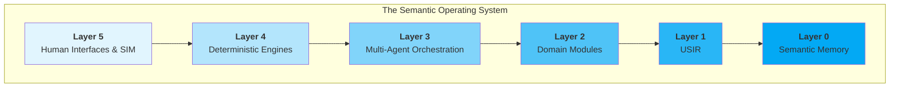

The Semantic Infrastructure Lab (SIL) Manifesto

On building the semantic substrate intelligent systems still lack.

## 0. Preface — What “Manifesto” Means Here

This is not ideology, hype, or a promise of magic.

"Manifesto" here means *making visible*: stating clearly what we believe is missing, what we intend to build, and what constraints govern that work.

SIL is a research lab. We build infrastructure: representations, memory, engines, orchestration, and interfaces—so that intelligent systems can reason with explicit meaning, not just generate plausible text.

## 1. The Problem — AI Without a Semantic Substrate

Contemporary AI systems are powerful and useful, but structurally incomplete.

Most modern systems operate primarily on statistical pattern learning over tokens. That yields impressive behaviors, but also persistent failures:

- **Lack of explicit meaning:** concepts and relationships are not represented as stable, machine-operable structures.
- **Brittle reasoning:** chains of inference cannot be inspected, validated, or reproduced.
- **Hallucinations:** outputs can be fluent while ungrounded, because there is no semantic contract[^1] enforcing correctness.
- **Weak memory and state:** systems forget, fragment context, and cannot carry durable semantic continuity across tasks or time.
- **Fragmented tools and domains:** code, CAD, simulation, workflows, logic, and data live in incompatible ecosystems.
- **Unreliable multi-agent behavior:** agents without shared structure and deterministic protocols behave inconsistently.
- **Poor provenance:** transformations and assumptions are often missing, making results hard to trust.

[^1]: A semantic contract specifies signatures, invariants, provenance requirements, and reproducibility guarantees binding an operator or transformation. See Technical Charter §7 and Glossary.

These are not superficial issues. They are symptoms of a missing layer: *a semantic foundation that makes meaning, memory, reasoning, tools, and provenance first-class*.

SIL exists to build that missing layer.

### The Material Transition

If AI today is wood—powerful, organic, useful, but structurally unreliable, prone to warping, splintering, and internal stresses invisible until failure—then SIL is building the steel infrastructure laboratory.

We're not just improving carpentry. We're designing:

- **The structural primitives** (semantic types that don't hallucinate)
- **The alloys** (composition operators for cross-domain work)
- **The fasteners** (provenance-preserving connections)
- **The building codes** (invariants and constraints that prevent collapse)
- **The inspection protocols** (verification systems for semantic validity)
- **The stress testing** (deterministic execution with reproducibility)

**This is not an incremental improvement. This is a material transition.**

When a fundamental building material becomes corrupted or structurally insufficient, you cannot fix houses, builders, tools, or carpenters. You must rebuild the substrate itself—the material and the entire supply chain around it.

That is what SIL is building: the steel for the age of intelligent systems.

## 1.5. Existence Proof — This Already Works

Before describing what SIL intends to build, recognize what already exists.

**The semantic substrate isn't hypothetical. It's operational. In production. Solving real problems.**

### Reveal: Semantic Infrastructure in Action

**reveal** (v0.23.0 on PyPI, ~2,000 downloads/month as of Dec 2025) demonstrates that when you prioritize structure, meaning, and provenance, you get systems that work better—and the benefits compound.

**The Problem reveal Solves:**

Developers and AI agents waste time reading entire files (500-5000 tokens) when they only need structure (50 tokens). Code exploration tools either show everything (cat, less) or nothing (ls). No progressive disclosure. No semantic understanding.

**The Semantic Solution:**

reveal provides **progressive disclosure**: Structure → Elements → Implementation

```bash
# Directory level - what's inside?
$ reveal src/
📁 src/
├── app.py (247 lines, Python)
├── database.py (189 lines, Python)
└── models/
    ├── user.py (156 lines, Python)
    └── post.py (203 lines, Python)

# File level - what structure exists?
$ reveal app.py
📄 app.py

Functions (3):
  app.py:15   load_config(path: str) -> Dict
  app.py:28   setup_logging(level: str) -> None
  app.py:42   main() -> int

Classes (2):
  app.py:95   Database
  app.py:145  RequestHandler

# Element level - what's the implementation?
$ reveal app.py load_config
app.py:15-27 | load_config

   15  def load_config(path: str) -> Dict:
   16      """Load configuration from JSON file."""
   17      if not os.path.exists(path):
   18          raise FileNotFoundError(f"Config not found: {path}")
   19      with open(path) as f:
   20          return json.load(f)
```

**Same pattern, different depths. Structure before content. Meaning made explicit.**

---

### Pattern Detection: Semantic Rules, Not Heuristics

reveal (v0.17.0+) doesn't just show code structure—it understands code quality patterns.

```bash
$ reveal app.py --check --select B,S
app.py:47  [B001] Bare except clause - catches all exceptions
app.py:103 [S701] Using :latest tag in Docker (security risk)
app.py:156 [U501] Insecure HTTP URL detected
```

Not statistical inference. Not "this might be a problem." **Explicit semantic rules detecting known patterns.**

Categories align with industry standards:
- **B** = Bugs (bare excepts, mutable defaults)
- **S** = Security (Docker :latest, hardcoded secrets)
- **C** = Complexity (cyclomatic complexity, function length)
- **E** = Errors (line length, syntax issues)

**Extensible:** Drop custom rules in `~/.reveal/rules/` → auto-discovered, zero configuration.

This IS semantic understanding: structure + explicit meaning → actionable insight.

---

### Universal Resource Exploration: Principles Transcend Code

reveal's URI adapter system (v0.17.0+) proves semantic patterns apply to ANY structured resource.

**Same progressive disclosure, different resource types:**

```bash
# Code (traditional)
$ reveal app.py
Functions: 5, Classes: 2

# Environment variables (v0.17.0 - shipped!)
$ reveal env://
env://
├── PATH (753 chars, 8 directories)
├── HOME (/home/user)
└── PYTHONPATH (2 directories)

$ reveal env://PATH
/usr/local/bin
/usr/bin
/bin
/home/user/.local/bin

# Databases (planned)
$ reveal postgres://prod
Tables: users, posts, comments, sessions

$ reveal postgres://prod users
Columns: id, email, created_at, updated_at

$ reveal postgres://prod users email
Column: email
Type: VARCHAR(255)
Nullable: false
Indexed: true
```

**Same pattern everywhere:** Resource → Structure → Elements → Details

**Same principles:**
- Structure before heuristics (see tables before reading data)
- Meaning made explicit (types, constraints visible)
- Provenance everywhere (postgres://prod/users/email)
- Composability (works in pipes, integrates with grep/vim)

This is the semantic substrate: **unified exploration across all domains.**

---

### AI Agent-First Design: Following the llms.txt Pattern

Just as websites provide `llms.txt` to guide AI agents, reveal provides `--agent-help` for CLI tools.

```bash
$ reveal --agent-help

# Returns comprehensive guide:
# - Decision trees (when to use reveal vs cat/grep/ast)
# - Workflow sequences (PR review, bug investigation, feature development)
# - Token efficiency analysis (reveal: 50 tokens vs cat: 500 tokens)
# - Anti-patterns (what NOT to do)
# - Pipeline composition (combining with git, find, jq)
```

**Not documentation for humans. Structural guidance for agents.**

Tools should teach agents how to use them effectively. reveal does.

**Economic Impact:**
- 10x-100x token savings (50 vs 500-5000 tokens)
- AI agents explore codebases without burning context windows
- Production use: Claude Code, Cursor, Aider use reveal-style exploration

---

### Zero Configuration: Structure Enables Smart Defaults

```bash
$ pip install reveal-cli
$ reveal app.py
# Works immediately. No config files. No setup.
```

**Why?**

Semantic types tell reveal what to do:
- `.py` file → Python analyzer → Tree-sitter Python grammar
- Directory → Tree view with file types
- Function name → Extract specific element

Structure is the interface. Types enable automatic routing.

**This is what "semantic infrastructure" means:**
When structure is explicit, the system knows what to do. No configuration needed.

---

### Economic Proof: Semantic Infrastructure Works

**Token Efficiency:**
- Reading full file: 500-5000 tokens (AI agent context window cost)
- `reveal app.py` structure: 50 tokens
- **10x-100x savings** = 10x-100x cost reduction for AI systems

**Adoption:**
- ~2,000 downloads/month (PyPI)
- 18 file types supported (Python, JS, TS, Rust, Go, C, C++, Java, etc.)
- Production use in AI coding assistants

**Composability:**
- Works with 50-year-old Unix tools (vim, git, grep, find)
- Doesn't replace—augments existing workflows
- `filename:line` format is universal interface

**Reliability:**
- Tree-sitter parsing (reliable, verifiable)
- Explicit errors (not silent failures)
- Reproducible output (same input → same structure)

---

### What This Proves

**These aren't promises. These are measurements.**

1. **Semantic infrastructure works** - Production use, ~2,000 downloads/month, measured efficiency
2. **The principles generalize** - Same pattern applies to code, env vars, databases, APIs
3. **The benefits compound** - Each new feature (pattern detection, URI adapters) leverages previous semantic structure
4. **It's economical** - 10x token savings, zero configuration, perfect composition

**The Material Transition Has Already Started:**

reveal is steel for code exploration. It doesn't warp (deterministic parsing). It doesn't splinter (explicit errors). It doesn't hide internal stresses (structure always visible). It composes reliably (Unix integration).

**This is one tool, in one domain (code exploration), demonstrating semantic infrastructure principles.**

---

### The Question Shifts

Not: "Can semantic infrastructure work?"

**But: "How fast can we expand this pattern to all domains?"**

- Code exploration: ✅ **Working** (reveal)
- Session management: ✅ **Working** (TIA - 1000+ sessions, semantic search, context continuity)
- Deterministic computation: ✅ **Working** (Morphogen - cross-domain, MLIR-based, 1,600+ tests)

**Next:**
- Knowledge graphs (Semantic Memory - Layer 1)
- Multi-agent protocols (Agent Ether - Layer 3)
- Universal IR (Pantheon - Layer 2)

**SIL isn't building "what if" systems. We're scaling what already works.**

---

### Why This Matters

**Old Narrative:**
"We're building semantic infrastructure" (sounds aspirational, distant future)

**Reality:**
"Our semantic infrastructure is already working in production—here's proof, here's how we scale to civilization-level systems"

**Credibility:**
Academic labs make big claims, rarely ship. SIL ships production tools that demonstrate the principles, then uses those learnings to design the next layer.

**Pattern:**
1. Build working tool (reveal, TIA, Morphogen)
2. Extract principles (progressive disclosure, structure-first, zero config)
3. Generalize (URI adapters prove patterns transcend code)
4. Scale to next domain (databases, APIs, knowledge graphs)

**This is the steel foundry in action.**

We're not talking about building semantic infrastructure.
We're refining what already works and scaling it to everything.

## 2. The Semantic Worldview — Epistemic Commitments

SIL is grounded in a simple stance: *meaning, structure, and reasoning must be explicit and inspectable*.

Our commitments are architectural, not rhetorical:

- **Meaning is structure** — Concepts, relationships, operators, and transformations must be represented in interpretable, compositional forms.
- **Reasoning is transformation** — Inference is the application of operators over structured representations—traceable, inspectable, and reversible where possible.
- **Memory is substrate** — Intelligence requires persistent semantic state that survives beyond a single prompt, run, or agent action.
- **Provenance is truth** — Every meaningful output should carry lineage: where it came from, what changed it, and under what assumptions.
- **Intelligence requires cross-domain coherence** — Domains are not isolated universes. They share deep patterns: constraints, invariants, abstractions, and operators.
- **Reproducibility is a design constraint** — Workflows and transformations should be predictable and repeatable. Stochasticity is allowed, but it must be explicit and tracked.
- **Interpretability is first-class** — Systems should expose internal structure and reasoning paths—not conceal them behind opaque heuristics.

These commitments are not philosophical decoration. They are engineering constraints. **[See SIL Principles →](./SIL_PRINCIPLES.md)** for how they guide system design.

## 3. Lineage — Computation as Representation and Transformation

Modern computing emerged from a tradition of formal representation: structured symbols, explicit operators, and transformations with clear semantics.

SIL is continuous with that lineage.

We treat computation as *the manipulation of explicit structure*, and we treat intelligence as requiring a substrate where structure can be represented, transformed, inspected, and shared.

Modern machine learning brought powerful statistical priors. SIL does not reject those tools. But we insist that *statistical pattern engines become far more reliable when grounded in explicit semantic infrastructure*.

## 4. What We Build — The Semantic Operating System

SIL's work assembles into a coherent, layered system: the **Semantic Operating System**.

It is not a single model. It is the substrate beneath models, agents, tools, and workflows.



### Layer 0 — Semantic Memory

A *persistent, interpretable, provenance-complete semantic graph*.

It stores concepts, relationships, operators, workflows, datasets, simulations, transformations, and their history. Semantic Memory is not a cache. It is not a prompt. It is durable semantic state.

### Layer 1 — USIR (Universal Semantic Intermediate Representation)

A *typed, explicit, graph-structured intermediate representation* that unifies:

- symbolic structures (math, logic)
- numeric structures (models, solvers)
- geometric structures (CAD, constraints)
- computational structures (code, workflows, plans)

USIR is the backbone that makes cross-domain transformations coherent and inspectable.

### Layer 2 — Domain Modules

Formalized domains provide:

- schemas and type systems
- invariants and constraints
- domain operators
- reasoning models
- deterministic tool adapters
- inspection and debugging tools

Early exemplar domains include: CAD/geometry, multi-physics simulation, code understanding, scientific modeling, and data workflows.

Domain modules are not "coverage." They are structure.

### Layer 3 — Multi-Agent Orchestration

A deterministic orchestration environment where agents:

- decompose tasks into explicit operators
- access shared semantic memory
- route work through tools coherently
- maintain state transitions explicitly
- record provenance for actions
- produce reproducible reasoning chains

The goal is not "more agents." The goal is *inspectable collaboration*.

### Layer 4 — Deterministic Engines

Computational engines—symbolic, numeric, simulation, search, planning, transformation—operate on USIR structures.

The commitment here is *predictable, reproducible transformations and workflows*, without pretending every computation can be strictly deterministic in all environments.

Engines exist to turn semantics into reliable computation.

### Layer 5 — Human Interfaces (including SIM)

SIL builds interfaces that make semantics visible and navigable through **SIM (Semantic Information Mesh)** - an interactive exploration environment:

- semantic visualization of graphs, invariants, and provenance
- modeling environments spanning domains
- reasoning inspectors that show operator-by-operator derivations
- workflow explorers and debuggers
- collaborative workspaces for humans and agents

This culminates in **SIM: the Semantic Information Mesh**—an environment for exploring semantic structure, transformation spaces, and cross-domain invariants with both humans and agents in the loop.

## 5. Invariants and Design Principles

SIL is governed by non-negotiables. These protect coherence over time.

- Interpretability as a first-class property
- Semantic clarity before computation
- Provenance everywhere
- Predictable, reproducible workflows
- Cross-domain unification via USIR
- Systems over ad hoc hacks
- Long-lived representations over short-term patches
- Small, focused teams and deep work
- Play as a method of discovery (paired with rigor)
- Open contribution with stewardship

These are architectural constraints, not slogans.

## 6. Boundaries — What We Reject

Clear edges prevent drift. SIL rejects:

- opaque black-box reasoning presented as "understanding"
- hallucination accepted as a feature rather than an error mode to constrain
- siloed representations that block interoperability
- ad hoc pipelines that cannot preserve provenance
- uninspectable agent behavior
- systems that trade structure for expedience
- hype-driven priorities that distort research incentives

SIL stops where semantics disappear: if a task cannot be represented as stable structures, operators, invariants, and provenance, it is outside the lab’s scope.

## 7. LLMs — Useful Pattern Engines, Not Semantic Systems

LLMs are powerful pattern engines. They can propose candidate structures, labels, decompositions, and hypotheses.

But completion is not the same as:

- semantic memory
- deterministic reasoning
- provenance-complete workflows
- cross-domain unification

SIL treats LLMs as components that become more valuable when grounded in the Semantic OS:

- LLMs propose; the Semantic OS represents and validates.
- LLMs suggest; operators transform with provenance.
- LLMs assist; engines prove, solve, and reproduce.

The lab builds the layer that makes these systems reliable.

## 8. Cross-Domain Consequences (Short, Technical)

A semantic substrate has predictable consequences. A few matter enough to name.

**Semantic "Superconductivity"** — When domains share a typed semantic backbone and transformations preserve provenance, cross-domain reasoning becomes low-friction: fewer lossy translations, fewer brittle glue layers, fewer one-off pipelines. Representation and reasoning flow through a common medium.

**Cross-Domain Invariants** — A unified substrate makes shared structure visible: constraints, symmetries, conservation-like relationships, dependency structures, stability conditions, reusable abstractions. These are not metaphors; they are patterns that become discoverable once representations align.

**Operator Composition Across Domains** — When operators are explicit and typed, workflows become composable: CAD → simulation → optimization → analysis becomes a sequence of inspectable transformations rather than a chain of opaque tool invocations.

The Semantic Interaction Model (SIM) - the human interface layer of the Semantic OS - exists partly to make these structures navigable and testable.

## 9. Openness and Stewardship

SIL treats knowledge as shared infrastructure. We encourage:

- open experimentation in sandboxes and branches
- structured proposals for integration
- transparent review and documentation
- a culture where failed experiments remain useful evidence

Stewardship protects coherence: invariants, types, provenance, and interpretability are maintained as the substrate grows.

Openness accelerates discovery; stewardship prevents drift.

## 10. Trajectory — Why This Matters

The long-term value of semantic infrastructure is not novelty. It is stability.

A semantic substrate enables:

- **reproducible reasoning and workflows** for science and engineering
- **verifiable transformations** in code, models, and simulations
- **dependable agents** that apply explicit operators rather than guess
- **unified toolchains** across domains that historically could not interoperate
- **interfaces that strengthen human understanding** by making structure navigable

Representations and operators outlast any model.

A real semantic substrate becomes durable infrastructure others can build on.

## 11. What We've Built — The SIL Ecosystem

SIL is not aspirational. It is operational.

The lab has developed **12 projects** spanning the six layers of the Semantic OS, with **4 production-ready systems** and over **3,100 tests** ensuring reliability:

**Production-Ready Today:**
- **Reveal** (v0.23.0 on PyPI) — Code exploration with 86% token reduction, Python runtime inspection, `--agent-help` standard with 3-tier progressive discovery
- **Morphogen** (v0.11) — Cross-domain deterministic computation
- **TiaCAD** (v3.1.2) — Declarative parametric CAD in YAML
- **GenesisGraph** (v0.3.0) — Verifiable provenance with selective disclosure
- **SIL** (v2.1) — Documentation and research hub

**Active Development:**
- RiffStack (musical MLIR), Sup (semantic UI), BrowserBridge (web agent bridge)

**Research & Specification:**
- Pantheon (universal IR), Agent Ether (multi-agent protocols), Prism (query microkernel)

This is not a roadmap. These are working systems with real users, measured efficiency (10x token reduction - [see FAQ](../meta/FAQ.md)), and test coverage that proves maturity.

**[See the full Project Index →](../../projects/PROJECT_INDEX.md)**

## 12. Founder Stance (Explicitly, Simply)

SIL is built from interest and skill alignment: a systems-oriented builder working on semantic infrastructure because it is meaningful work.

No destiny framing. No myth-making.

Just commitment to building a rigorous substrate that helps humans understand, create, and discover.

## 13. The Declaration

SIL builds the semantic substrate that current AI systems lack: persistent semantic memory, a unified intermediate representation, structured domain modules, reproducible orchestration, deterministic engines, and human interfaces for inspectable reasoning.

We make meaning explicit.

We make reasoning traceable.

We build structures that last.

That is the work.

---

## Related Reading

**If you want to understand the architecture:**
- [Semantic OS Architecture](./SIL_SEMANTIC_OS_ARCHITECTURE.md) - The 6-layer stack in detail
- [Unified Architecture Guide](../architecture/UNIFIED_ARCHITECTURE_GUIDE.md) - Universal patterns across all projects
- [Technical Charter](./SIL_TECHNICAL_CHARTER.md) - Formal specification (45 min read)

**If you want to see it in action:**
- [Project Index](../../projects/PROJECT_INDEX.md) - All 12 projects explained
- [Tools Documentation](../tools/README.md) - Production systems with economic impact data
- [Start Here](./START_HERE.md) - Try reveal in 10 minutes

**If you want deeper principles:**
- [Design Principles](./SIL_PRINCIPLES.md) - The 14 constraints that guide all work
- [Stewardship Manifesto](./SIL_STEWARDSHIP_MANIFESTO.md) - How SIL is governed
- [Founder's Letter](./FOUNDERS_LETTER.md) - Personal context and lab purpose

**If you want research depth:**
- [RAG Paper](../research/RAG_AS_SEMANTIC_MANIFOLD_TRANSPORT.md) - Semantic manifold transport framework
- [Agent-Help Standard](../research/AGENT_HELP_STANDARD.md) - Progressive disclosure for agents
- [Research Agenda Year 1](./SIL_RESEARCH_AGENDA_YEAR1.md) - Near-term research direction