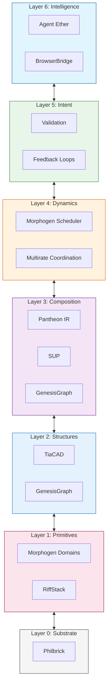

# SIL Semantic OS Architecture

**Version:** 2.0 (December 2025)
**Canonical Reference:** [SIL_GLOSSARY.md](./SIL_GLOSSARY.md)

## TL;DR (2-minute overview)

**What is the Semantic OS?** A 7-layer architecture for knowledge work—like Linux for computation, but for meaning.

**The core insight:** Just as an OS manages processes, memory, and devices, the Semantic OS manages **knowledge, agents, and deterministic computation**.

```
Layer 6: Intelligence    (Agent Ether, BrowserBridge)     ← Multi-agent coordination
Layer 5: Intent          (Pantheon validation)            ← Constraints & feedback loops
Layer 4: Dynamics        (Morphogen scheduler)            ← Temporal execution
Layer 3: Composition     (Pantheon IR, SUP)               ← Cross-domain integration
Layer 2: Structures      (TiaCAD, GenesisGraph)           ← Data structures & provenance
Layer 1: Primitives      (Morphogen domains)              ← 40+ computational domains
Layer 0: Substrate       (Philbrick hardware)             ← Hardware foundation
─────────────────────────────────────────────────────────────────────────────────
Cross-cutting: Observability (Reveal), Provenance (GenesisGraph), Trust (TAP)
```

**Key innovations:**
- **Hardware-software co-design** from Philbrick substrate to agent intelligence
- **Universal IR** enabling cross-domain interoperability (Pantheon)
- **Deterministic execution** for reproducible workflows (Morphogen)
- **Multi-agent protocols** for inspectable collaboration (Agent Ether)
- **Verifiable provenance** at every layer (GenesisGraph)

**Want the full architecture?** Read the detailed layer descriptions below ↓

> 💡 **New to SIL terminology?** Keep the [Glossary](./SIL_GLOSSARY.md) open in another tab.



### Layer Model Evolution

This document was originally written with a 6-layer conceptual model. The current canonical 7-layer model (above) reflects implementation learnings. The detailed layer descriptions below use the original naming but map to the current model as follows:

| Original (This Doc) | Current Canonical | Key Products |
|---------------------|-------------------|--------------|
| L0: Semantic Memory | L2-L3: Structures/Composition | GenesisGraph, Beth |
| L1: Pantheon IR | L3: Composition | Pantheon IR |
| L2: Domain Modules | L1: Primitives | Morphogen domains |
| L3: Agent Ether | L6: Intelligence | Agent Ether, BrowserBridge |
| L4: Deterministic Engines | L1+L4: Primitives+Dynamics | Morphogen |
| L5: Human Interfaces | (Cross-cutting) | Reveal, TIA, SUP |
| (Not in original) | L0: Substrate | Philbrick |
| (Not in original) | L5: Intent | Pantheon validation |

---

## Overview

The **Semantic Operating System** is the core technical infrastructure being developed by SIL-Core. It is a modular, layered architecture for knowledge work—analogous to how Linux provides an operating system for computation.

Just as an operating system manages processes, memory, files, and devices, the Semantic OS manages **knowledge, meaning, agents, and deterministic computation**.

---

## Detailed Layer Descriptions

> **Note:** The sections below use the original 6-layer naming from the initial architecture design. See the [Layer Model Evolution](#layer-model-evolution) table above for mapping to the current 7-layer canonical model.

Each layer is described in detail with its purpose, core capabilities, and relationships to other layers.

---

## Layer 0: Semantic Memory (The Foundation)

### Purpose

Semantic Memory is the **persistent knowledge substrate**—the "file system" for meaning. It stores, indexes, and retrieves structured knowledge with full provenance tracking.

### Core Capabilities

**1. Knowledge Representation**
- Entities, relationships, attributes (semantic triples)
- Temporal versioning (knowledge evolves over time)
- Uncertainty and confidence (probabilistic assertions)
- Provenance metadata (where did this knowledge come from?)

**2. Storage Engines**
- Graph databases (Neo4j, TerminusDB, or custom)
- Triple stores (RDF-based)
- Content-addressable storage (IPFS-like) — **See:** [Distributed Storage Architecture](../architecture/DISTRIBUTED_STORAGE_ARCHITECTURE.md) for IPFS integration strategy
- Hybrid relational + graph models

**3. Query Languages**
- SPARQL for RDF graphs
- Cypher for property graphs
- Custom semantic query DSL
- Natural language → structured query translation

**4. Provenance Tracking (GenesisGraph)**
- Every fact linked to its source
- Full lineage from raw inputs to derived knowledge
- Cryptographic attestation of derivations
- Reproducibility guarantees

**5. Knowledge Lifecycle**
- Ingestion (raw data → structured knowledge)
- Validation (consistency, completeness checks)
- Evolution (updating beliefs as evidence changes)
- Archiving (deprecated knowledge preserved for historical queries)

### Design Principles

**Content-Addressable:**
- Knowledge identified by cryptographic hash of its content
- Same knowledge → same identifier (deduplication)
- Changes → new identifier (immutability + versioning)

**Provenance-First:**
- Every assertion includes source metadata
- Audit trails enable trust verification
- Reproducible derivations

**Multi-Tenant:**
- Different projects, users, domains share infrastructure
- Privacy and access control enforced
- Cross-domain queries when permitted

### Example Use Cases

**SIL-Civilization Water Module:**
- Stores semantic representation of water utility infrastructure
- Tracks lineage from sensor data → analysis → policy recommendations
- Enables queries like "Which pipes were manufactured before 1950?" or "What's the provenance of this risk assessment?"

**SIL-Core Research:**
- Stores all research papers, notes, and documentation
- Links concepts across documents
- Enables queries like "Find all work related to morphogenesis and computation"

---

## Layer 1: Pantheon IR (Intermediate Representation)

### Purpose

Pantheon IR is the **universal semantic type system**—the "assembly language" for knowledge composition. It defines standard representations that enable different domain modules to interoperate.

### Inspiration

Named after the Pantheon in Rome—a building that unifies diverse architectural traditions under one dome. Pantheon IR unifies diverse domain semantics under one common representational framework.

### Core Capabilities

**1. Universal Type System**
- Primitive types (integers, floats, strings, booleans, timestamps)
- Composite types (structs, unions, enums, algebraic data types)
- Semantic types (entities, relationships, events, processes)
- Higher-order types (functions, constraints, specifications)

**2. Translation Protocols**
- Domain-specific schema → Pantheon IR
- Pantheon IR → Domain-specific schema
- Lossless round-tripping where possible
- Graceful degradation when perfect translation is impossible

**3. Composition Operators**
- Merge (combining knowledge from multiple sources)
- Join (relating entities across domains)
- Transform (applying functions to semantic data)
- Validate (checking constraints and invariants)

**4. Versioning and Evolution**
- Schema migrations (v1 → v2 without breaking existing data)
- Backwards compatibility guarantees
- Deprecation pathways for old representations

**5. Formal Semantics**
- Type soundness proofs
- Specification languages for constraints
- Formal verification of translations

### Design Principles

**Minimal but Sufficient:**
- Small core language (like LLVM IR for code)
- Everything else compiles to core primitives
- Avoid feature bloat

**Composable:**
- Small modules combine to express complex semantics
- No monolithic schemas

**Human-Readable:**
- Pantheon IR can be read and written by humans (not just machines)
- Good error messages when things don't type-check

### Example Use Cases

**Cross-Domain Queries:**
- "Which healthcare facilities are downstream of this water treatment plant?" requires joining Water and Healthcare modules via Pantheon IR

**Policy Simulation:**
- Governance module expresses policy in Pantheon IR → executable simulation in Deterministic Engines

**Multi-Agent Collaboration:**
- Agents from different domains negotiate via Pantheon IR messages

---

## Layer 2: Domain-Specific Modules

### Purpose

Domain modules are **specialized knowledge systems** for different civilizational domains—water, healthcare, education, governance, energy, transportation, etc. They are the "applications" running on the semantic kernel.

### Structure

Each domain module provides:

**1. Domain Schema (in Pantheon IR)**
- Entities (e.g., Water: pipes, pumps, reservoirs, treatment plants)
- Relationships (e.g., "pipe connects reservoir to distribution network")
- Processes (e.g., "water treatment workflow")
- Constraints (e.g., "flow rate must be positive")

**2. Domain Logic**
- Rules and policies (e.g., "if chlorine level < threshold, alert operator")
- Simulation models (e.g., hydraulic flow simulation)
- Optimization algorithms (e.g., pump scheduling)
- Analytics (e.g., predictive maintenance)

**3. Integration Adapters**
- Import from domain-specific tools (e.g., EPANET for water networks)
- Export to domain-specific formats
- Bi-directional synchronization with external systems

**4. Domain APIs**
- REST APIs for external applications
- GraphQL for flexible querying
- Streaming APIs for real-time data

### Example Domains

**Water Infrastructure Module:**
- Semantic model of water distribution networks
- Integration with SCADA systems
- Hydraulic simulation via EPANET
- Risk assessment and maintenance scheduling

**Healthcare Module:**
- Patient care pathways as semantic workflows
- Medical knowledge representation (diagnoses, treatments, outcomes)
- Integration with EHR systems
- Clinical decision support

**Education Module:**
- Curriculum as knowledge graph
- Learning pathways and prerequisites
- Student progress tracking
- Adaptive content recommendation

**Governance Module:**
- Regulatory knowledge representation
- Policy as code
- Participatory governance platforms
- Simulation of policy impacts

**Transportation Module:**
- Road network semantics
- Public transit scheduling
- Traffic simulation
- Multimodal route planning

### Design Principles

**Domain Expertise Required:**
- Modules developed in partnership with domain experts (civil engineers, doctors, educators)
- SIL-Civilization researchers bridge CS and domain knowledge

**Interoperable by Default:**
- All modules use Pantheon IR
- Cross-domain queries are first-class citizens

**Open and Extensible:**
- Third parties can develop new domain modules
- Documented extension points and APIs

---

## Layer 3: Agent Ether (Multi-Agent Protocols)

### Purpose

Agent Ether is the **coordination layer** for multi-agent systems. It provides protocols for agents (human or AI) to discover capabilities, negotiate tasks, compose workflows, and collaborate.

### Metaphor

"Ether" as in the luminiferous ether—the hypothetical medium through which light was thought to travel. Agent Ether is the medium through which coordination and communication propagate across the semantic ecosystem.

### Core Capabilities

**1. Agent Registry and Discovery**
- Agents advertise their capabilities (e.g., "I can analyze water networks")
- Capability matching (e.g., "Who can help with this task?")
- Reputation and trust metrics

**2. Protocol Suite**
- **Task Delegation:** One agent requests another to perform a task
- **Negotiation:** Agents agree on terms (e.g., "I'll analyze this if you provide sensor data")
- **Composition:** Complex workflows built from simple agent capabilities
- **Consensus:** Multiple agents agree on facts or decisions
- **Verification:** Agents verify each other's work

**3. Choreography vs Orchestration**
- **Choreography:** Agents coordinate peer-to-peer (decentralized)
- **Orchestration:** Central coordinator directs agents (centralized)
- Both patterns supported depending on use case

**4. Semantic Messaging**
- All messages in Pantheon IR (universal understanding)
- Type-safe communication
- Provenance of messages (who sent, when, why)

**5. Emergent Coordination**
- Simple agent behaviors → complex emergent patterns
- Swarm intelligence for distributed problem-solving
- Self-organizing agent networks

### Design Principles

**Heterogeneous Agents:**
- Human agents (researchers, operators, decision-makers)
- AI agents (LLMs, optimization engines, simulation runners)
- Hybrid human-AI teams

**Fault Tolerant:**
- Agents can fail without crashing the system
- Graceful degradation
- Automatic retry and recovery

**Privacy-Preserving:**
- Agents can collaborate without revealing sensitive data
- Zero-knowledge proofs where appropriate
- Differential privacy for aggregate queries

### Example Use Cases

**Multi-Domain Infrastructure Analysis:**
- Water agent: "I detect anomaly in flow data"
- Healthcare agent: "I'll check for correlations with waterborne illness reports"
- Governance agent: "I'll notify relevant regulatory authorities"
- All coordinated via Agent Ether

**Collaborative Research:**
- Human researcher: "I need to analyze this dataset"
- AI agent 1: "I can run statistical analysis"
- AI agent 2: "I can generate visualizations"
- AI agent 3: "I can search literature for similar studies"
- All agents coordinate to produce comprehensive report

---

## Layer 4: Deterministic Execution Engines (Morphogen)

### Purpose

Deterministic Execution Engines provide **reproducible, verifiable computation**. Given the same inputs and code, they **always** produce the same outputs—critical for scientific reproducibility, auditing, and trust.

### Core Technology: Morphogen

Morphogen is SIL's flagship deterministic computation platform (named after Alan Turing's morphogenesis work). It builds on ideas from Nix, Bazel, and content-addressable computation.

### Core Capabilities

**1. Hermetic Execution**
- All dependencies explicitly declared
- No hidden state or side effects
- Sandboxed execution (no network, no filesystem access except declared inputs)

**2. Content-Addressable Caching**
- Computation results stored by hash of inputs + code
- Identical inputs + code → retrieve cached result (no recomputation)
- Massive speedup for repeated analyses

**3. Cryptographic Verification**
- Every computation produces cryptographic proof of correctness
- Third parties can verify results without re-running
- Audit trails for regulatory compliance

**4. Incremental Computation**
- Small input changes → only recompute affected parts
- Build graphs track dependencies
- Minimal recomputation on updates

**5. Distributed Execution**
- Computation graphs distributed across cluster
- Automatic parallelization
- Fault tolerance (rerun failed tasks on different nodes)

### Design Principles

**Reproducibility First:**
- Scientific results must be reproducible
- "It works on my machine" is not acceptable

**Provenance Everywhere:**
- Every output linked to exact inputs, code version, execution environment
- Full lineage tracking (GenesisGraph integration)

**Performance Through Caching:**
- Determinism enables aggressive caching
- Vast majority of computations are cache hits in mature systems

### Example Use Cases

**Policy Simulation:**
- Governance module runs policy simulation via Morphogen
- Results are reproducible and verifiable by third parties
- Changes to policy parameters → only affected parts recomputed

**Scientific Analysis:**
- Researcher analyzes dataset with Morphogen
- Analysis is reproducible by other researchers
- Results published with cryptographic proof of correctness

**Infrastructure Optimization:**
- Water module optimizes pump schedules
- Optimization is deterministic and auditable
- Regulators can verify results without re-running expensive optimization

---

## Layer 5: Human Interfaces

### Purpose

Human Interfaces are how people interact with the Semantic OS—CLIs, GUIs, conversational agents, APIs, visualizations. This layer translates between human intent and semantic operations.

### Interface Modalities

**1. Command-Line Interfaces (CLIs)**
- Power users and developers
- Scripting and automation
- Composable with Unix tools

**2. Graphical User Interfaces (GUIs)**
- General users and domain experts
- Visual exploration of knowledge graphs
- Interactive dashboards and visualizations

**3. Conversational Agents**
- Natural language queries
- Guided workflows ("What do you want to do?" → step-by-step guidance)
- Explanations and help

**4. APIs (REST, GraphQL, gRPC)**
- External applications integrating with Semantic OS
- Third-party tools and extensions
- Programmatic access

**5. Visualization Tools**
- Graph visualizations (knowledge graphs, dependency graphs)
- Geospatial maps (for infrastructure)
- Temporal visualizations (how knowledge evolves over time)

### Design Principles

**Progressive Disclosure:**
- Simple tasks are simple
- Complex tasks are possible
- Don't overwhelm beginners, don't limit experts

**Multi-Modal:**
- Users can switch between CLI, GUI, conversation as needed
- State synchronized across modalities

**Accessible:**
- WCAG accessibility standards
- Screen reader support
- Keyboard navigation
- High contrast modes

**Explainable:**
- System explains its reasoning
- Provenance shown in human-readable form
- "How did you arrive at this conclusion?" always answerable

### Example Use Cases

**Water Utility Operator (GUI):**
- Dashboard shows real-time water network status
- Alerts for anomalies
- Click on pipe → see full history, maintenance records, risk assessment
- Provenance shown: "This risk assessment was computed on 2025-11-29 using flow data from sensors X, Y, Z"

**Researcher (CLI):**
- Query knowledge graph: `semantic query "papers about morphogenesis"`
- Run analysis: `morphogen run analyze-dataset --input data.csv`
- Check provenance: `genesis-graph trace result.json`

**Policy Maker (Conversational Agent):**
- "What would happen if we increased water treatment capacity by 20%?"
- Agent runs simulation, shows results
- "Why did the cost increase?" → Agent explains decision tree

---

## Cross-Layer Concerns

### 1. Provenance (GenesisGraph)

Provenance flows through all layers:
- Layer 0 (Semantic Memory): Stores provenance metadata
- Layer 1 (Pantheon IR): Provenance as first-class type
- Layer 2 (Domain Modules): Domain-specific provenance (e.g., sensor lineage)
- Layer 3 (Agent Ether): Message provenance (who sent, why)
- Layer 4 (Morphogen): Computation provenance (inputs → outputs)
- Layer 5 (Human Interfaces): Provenance visualization

### 2. Security and Privacy

Security considerations at each layer:
- Layer 0: Access control to knowledge graphs
- Layer 1: Type-level privacy constraints
- Layer 2: Domain-specific privacy rules (HIPAA, GDPR)
- Layer 3: Encrypted agent communication
- Layer 4: Sandboxed execution, no data leakage
- Layer 5: Authentication, authorization, audit logs

### 3. Performance and Scalability

Scalability strategies:
- Layer 0: Distributed graph databases, sharding
- Layer 1: Efficient compilation to Pantheon IR
- Layer 2: Domain-specific optimizations
- Layer 3: Decentralized agent coordination
- Layer 4: Distributed execution, caching
- Layer 5: Client-side rendering, edge computing

---

## Development Roadmap

### Phase 1: Foundation (Years 1-2)

**Priority: Layers 1, 2, 5**
- Build Semantic Memory with GenesisGraph provenance
- Design and implement Pantheon IR
- Launch Morphogen v1 (basic deterministic execution)

**Deliverables:**
- Research prototype of Semantic OS kernel
- Published papers on Pantheon IR and Morphogen
- Open-source releases

### Phase 2: Domain Modules (Years 2-4)

**Priority: Layer 3**
- Develop 3-5 flagship domain modules (Water, Healthcare, Education)
- Prove interoperability via cross-domain queries
- Deploy pilot systems in real-world contexts

**Deliverables:**
- Production-ready domain modules
- Case studies of real-world deployments
- Cross-domain integration demonstrations

### Phase 3: Multi-Agent Systems (Years 4-6)

**Priority: Layer 4**
- Design and implement Agent Ether protocols
- Build human-AI collaboration tools
- Enable emergent coordination patterns

**Deliverables:**
- Multi-agent research platform
- Human-in-the-loop workflows
- Published research on semantic agent coordination

### Phase 4: Human Interfaces (Years 5-7)

**Priority: Layer 5**
- Design exceptional user experiences for all modalities
- Build accessible, explainable interfaces
- Enable broad adoption beyond specialists

**Deliverables:**
- Polished CLI, GUI, conversational agents
- Public-facing Semantic OS distributions
- Documentation and tutorials for general users

### Phase 5: Ecosystem Maturity (Years 7-10)

**All Layers:**
- Refine based on real-world usage
- Support third-party extensions and modules
- Grow community of contributors and users
- Establish Semantic OS as foundational infrastructure

---

## Architectural Principles

### 1. Modularity

Each layer is independently useful:
- Semantic Memory can be used without Morphogen
- Morphogen can be used without Agent Ether
- Domain modules can be developed independently

### 2. Interoperability

Layers communicate via well-defined interfaces:
- Pantheon IR as universal semantic type system
- Standard APIs between layers
- No hidden dependencies

### 3. Openness

Entire stack is open source:
- Permissive licenses (Apache 2.0, MIT)
- Public development (GitHub)
- Community governance

### 4. Long-Term Thinking

Built for decades, not quarters:
- Stable APIs (breaking changes are rare and well-communicated)
- Backwards compatibility guarantees
- Designed to outlast any individual researcher or project

---

## Comparison to Traditional OS

| Traditional OS | Semantic OS |
|----------------|-------------|
| **Processes** | Agents (human + AI) |
| **Memory** | Semantic Knowledge Graphs |
| **File System** | Provenance-Tracked Knowledge Repository |
| **Kernel** | Pantheon IR + Morphogen |
| **Device Drivers** | Domain-Specific Modules |
| **System Calls** | Agent Ether Protocols |
| **Shell/GUI** | Human Interfaces (CLI, GUI, Conversation) |

Just as Linux abstracts hardware and provides common services for applications, Semantic OS abstracts knowledge work and provides common services for civilizational systems.

---

## Conclusion

The Semantic OS is **infrastructure for the age of AI and civilizational-scale challenges**. The 7-layer architecture provides:

- **L0 Substrate** — Hardware foundation (Philbrick) enabling software/hardware co-design
- **L1 Primitives** — 40+ unified computational domains (Morphogen)
- **L2 Structures** — Data structures with spatial reasoning (TiaCAD) and provenance (GenesisGraph)
- **L3 Composition** — Cross-domain semantic integration (Pantheon IR, SUP)
- **L4 Dynamics** — Deterministic temporal execution (Morphogen scheduler)
- **L5 Intent** — Validation, constraints, and feedback loops
- **L6 Intelligence** — Multi-agent coordination (Agent Ether, BrowserBridge)

Plus cross-cutting concerns: **Observability** (Reveal), **Provenance** (GenesisGraph), **Trust** (TAP).

Together, these seven layers form a **unified platform for building civilizational infrastructure**.

This is the technical core of SIL's mission.

---

**Related Documents:**
- [SIL Glossary](./SIL_GLOSSARY.md) — Canonical layer definitions (L0-L6)
- [SIL Principles](./SIL_PRINCIPLES.md) — The 14 guiding principles
- [Semantic Feedback Loops](./SEMANTIC_FEEDBACK_LOOPS.md) — Closed-loop control theory
- [Semantic Observability](./SEMANTIC_OBSERVABILITY.md) — Intent-execution alignment
- [Unified Architecture Guide](../architecture/UNIFIED_ARCHITECTURE_GUIDE.md) — The universal pattern
