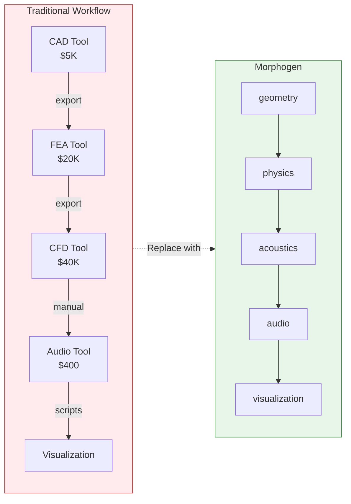
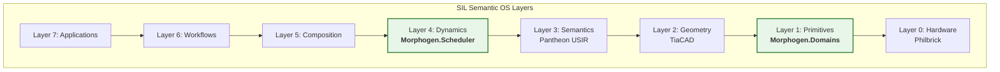

# Morphogen: Cross-Domain Deterministic Computation

> *Where computation becomes composition*

## The Problem

**Domain fragmentation fractures professional workflows:**

- Export CAD geometry → import to FEA → export mesh → import to CFD → manually couple results back to CAD
- Write audio DSP in C++ → physics simulation in Python → visualization in JavaScript → bridge with brittle scripts
- Audio synthesis can't talk to circuit design. Physics can't talk to chemistry. Geometry can't talk to optimization.
- **Each domain has its own tools, types, data formats, and execution models.**

**Result:** 3-5 separate tool workflows, manual data translation, incompatible type systems, non-deterministic results across platforms.

Current tools force you to be a systems integrator before you can be a creator.



---

## The Innovation

**40+ computational domains unified in ONE type system with physical units enforced at compile time.**

Morphogen eliminates domain fragmentation through:

### Universal Type System with Physical Units
```morphogen
temp : Field2D<f32 [K]>           # Temperature in Kelvin
pos : Vec2<f32 [m]>                # Position in meters
vel : Vec2<f32 [m/s]>              # Velocity in m/s
force : Vec2<f32 [N]>              # Force in Newtons

# Unit checking at compile time
speed = distance / time            # OK: f32 [m/s]
x = distance + time                # ERROR: m + s is invalid
```

### Bitwise-Deterministic Execution
- Three determinism profiles: `strict` (bit-exact), `repro` (deterministic FP), `live` (low-latency)
- Explicit RNG seeding, sample-accurate event scheduling
- Same results across platforms, GPUs, and operating systems

### Multirate Execution
- Single scheduler handles multiple rates: audio @ 48kHz, control @ 60Hz, physics @ 240Hz
- Type-safe connections between domains (field → agent force, geometry → audio impulse response)
- Zero manual synchronization - the scheduler handles it

### Transform-First Thinking
- FFT, STFT, wavelets, DCT as first-class operations
- Domain changes (time ↔ frequency, space ↔ k-space) are core primitives
- Uniform transform API across all computational domains

---

## Quick Example: Cross-Domain Composition in Action

**One program. Three domains. Zero glue code.**

```morphogen
# Couple fluid dynamics → acoustics → audio synthesis
use fluid, acoustics, audio

# Simulate airflow in a 2-stroke engine exhaust
@state flow : FluidNetwork1D = engine_exhaust(length=2.5m, diameter=50mm)
@state acoustic : AcousticField1D = waveguide_from_flow(flow)

flow(dt=0.1ms) {
    # Fluid dynamics: pressure pulses from engine
    flow = flow.advance(engine_pulse(t), method="lax_wendroff")

    # Couple to acoustics: flow → sound propagation
    acoustic = acoustic.couple_from_fluid(flow, impedance_match=true)

    # Synthesize audio from acoustic field
    let exhaust_sound = acoustic.to_audio(mic_position=1.5m)

    # Real-time output
    audio.play(exhaust_sound)
}
```

**This is impossible in existing tools.** You'd need:
- ANSYS Fluent (fluid dynamics) → $40K/year
- COMSOL Acoustics (sound propagation) → $15K/year
- Max/MSP or Pure Data (audio synthesis) → $400
- Custom Python scripts to bridge incompatible data formats
- Hours of manual export/import cycles per iteration

**Morphogen does it in one deterministic, reproducible program.**

---

## Status & Adoption

**Current Version:** v0.11.0 (Production-Ready)

**Production Metrics:**
- ✅ **40+ computational domains** spanning physics, audio, chemistry, graphics, geometry
- ✅ **1,600+ comprehensive tests** - all passing, zero technical debt
- ✅ **MLIR compilation pipeline** complete with 6 custom dialects
- ✅ **Deterministic execution** across all platforms (bitwise-identical results)

**Novel Research Contributions:**

1. **Cross-Domain Type Unification**
   - Audio (Hz, dB) + Physics (m, kg, s) + Circuits (V, A, Ω) + Chemistry (mol, K) in one type system
   - Physical unit checking at compile time prevents dimensional errors

2. **Multirate Deterministic Scheduler**
   - Multiple execution rates in single program (48kHz audio, 60Hz control, 240Hz physics)
   - Sample-accurate event scheduling with deterministic RNG
   - No manual synchronization required

3. **Transform-First Computational Model**
   - Time ↔ frequency, space ↔ k-space as first-class operations
   - Uniform transform API across all domains
   - Enables novel cross-domain compositions

4. **Production MLIR Compilation**
   - 6 custom dialects (Flow, Field, Agent, Audio, Temporal, Transform)
   - Lowers to optimized CPU/GPU code via LLVM
   - Field operations, agents, audio DSP all compile to native code

**What This Unlocks:**
- **3-5 tool workflows eliminated** - Design, simulate, and synthesize in one environment
- **Reproducible research** - Bitwise-identical results enable scientific validation
- **Professional adoption** - Audio production, digital twins, scientific computing, education

**v1.0 Release Timeline:** 2026-Q2 (24-week roadmap active)
- Symbolic + numeric execution (SymPy integration)
- Circuit → Audio coupling (design pedal circuits, hear sound instantly)
- Category theory optimization (verified composition, automatic fusion)
- 50+ integrated domains

---

## Technical Deep Dive

**Full Documentation:**
- [Morphogen GitHub Repository](https://github.com/Semantic-Infrastructure-Lab/morphogen)
- [Complete Language Specification](https://github.com/Semantic-Infrastructure-Lab/morphogen/blob/main/SPECIFICATION.md) (2,282 lines)
- [Domain Catalog](https://github.com/Semantic-Infrastructure-Lab/morphogen/blob/main/docs/DOMAINS.md) - All 40+ domains with examples
- [Architecture Guide](https://github.com/Semantic-Infrastructure-Lab/morphogen/blob/main/docs/architecture/) - MLIR compilation, Graph IR, execution model

**Example Gallery:**
- [24 Working Examples](https://github.com/Semantic-Infrastructure-Lab/morphogen/tree/main/examples) - Fluid dynamics, reaction-diffusion, audio synthesis, physics

**Getting Started:**
```bash
git clone https://github.com/Semantic-Infrastructure-Lab/morphogen.git
cd morphogen
pip install -e .
morphogen run examples/heat_diffusion.kairo
```

---

## Part of SIL's Semantic OS Vision



**Morphogen's Role in the 7-Layer Semantic OS:**

- **Layer 1 (Primitives):** Domain-specific operations with semantic types
  - 40+ computational domains (field, agent, audio, rigidbody, chemistry, graphics)
  - Physical unit enforcement at compile time
  - Transform-first operations (FFT, STFT, wavelets, DCT)

- **Layer 4 (Dynamics):** Multirate deterministic temporal execution
  - Sample-accurate event scheduling
  - Multiple execution rates in single program (audio @ 48kHz, physics @ 240Hz)
  - Three determinism profiles (strict, repro, live)

**Composes With:**
- **Pantheon (Layer 3):** Universal Semantic IR - Morphogen adapter provides bidirectional translation (proven with round-trip fidelity tests)
- **Philbrick (Layer 0):** Hardware substrate - Software/hardware mirror, same compositional philosophy
- **RiffStack (Layer 1):** Live performance interface - Real-time interaction layer for Morphogen.Audio
- **TiaCAD (Layer 2):** Geometric modeling - Geometry → Morphogen field operations

**Architectural Principle:** *Computation = Composition*

Morphogen proves that semantic-first design enables fundamentally different relationships between domains. When domains share a type system and execution model, composition becomes natural instead of heroic.

**Sister Project: Philbrick**

Morphogen (digital) and [Philbrick](https://github.com/Semantic-Infrastructure-Lab/philbrick) (analog/hybrid hardware) are two halves of one vision:
- **Same four core operations:** Sum, integrate, nonlinearity, events
- **Same compositional philosophy:** Modular computation through typed connections
- **Future goal:** Compile to each other (design in Morphogen → build in Philbrick)

---

## Impact: Professional Workflows Transformed

**Before Morphogen:**
- CAD → FEA → CFD pipeline: 5 tools, manual data translation, weeks per iteration
- Audio synthesis + physical modeling: C++ DSP + Python physics + JavaScript UI
- Chemistry + thermodynamics: Separate quantum/classical solvers, no cross-domain coupling

**With Morphogen:**
- One deterministic program spans all domains
- Type-safe composition prevents dimensional errors
- Bitwise-reproducible results enable scientific validation
- 3-5 tool workflows eliminated

**Use Cases Enabled:**
- **Education:** Multi-physics simulations with interactive visualizations
- **Digital Twins:** Real-time system simulation with predictive maintenance
- **Audio Production:** Physical modeling synthesis with circuit design coupling
- **Scientific Computing:** Coupled PDE systems, reaction-diffusion, quantum chemistry
- **Creative Coding:** Procedural generation with audio-reactive visuals

---

**Version:** 0.11.0 → 1.0 (2026-Q2)
**License:** Apache 2.0
**Status:** Production-ready with active v1.0 development

**Learn More:**
- [GitHub Repository](https://github.com/Semantic-Infrastructure-Lab/morphogen)
- [v1.0 Release Plan](https://github.com/Semantic-Infrastructure-Lab/morphogen/blob/main/docs/planning/MORPHOGEN_RELEASE_PLAN.md)
- [Complete Documentation](https://github.com/Semantic-Infrastructure-Lab/morphogen/blob/main/docs/)
