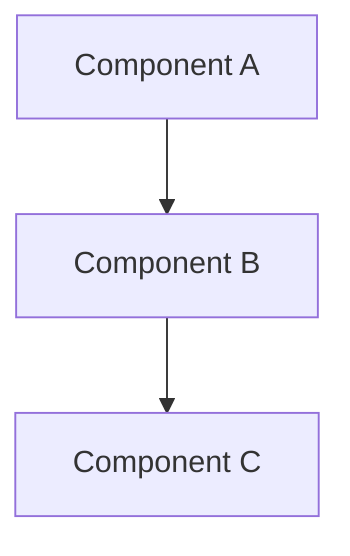

# SIL Markdown Style Guide

This guide ensures consistent, readable markdown across all SIL documentation.

## Core Principle

**Never split inline content across lines.** This is the #1 cause of awkward rendering.

## Anti-Patterns to Avoid

### 1. Orphaned Emphasis

```markdown
# BAD - emphasis on separate line
"Manifesto" here means
making visible
: stating clearly...

# GOOD - inline emphasis
"Manifesto" here means *making visible*: stating clearly...
```

### 2. Definition Lists Without Formatting

```markdown
# BAD - looks like prose, renders awkwardly
Lack of explicit meaning:
 concepts and relationships are not represented...

Brittle reasoning:
 chains of inference cannot be inspected...

# GOOD - proper list formatting
- **Lack of explicit meaning:** concepts and relationships are not represented...
- **Brittle reasoning:** chains of inference cannot be inspected...
```

### 3. Inline Content Split Across Lines

```markdown
# BAD - mid-sentence line break
We treat computation as
the manipulation of explicit structure
, and we treat intelligence...

# GOOD - complete inline emphasis
We treat computation as *the manipulation of explicit structure*, and we treat intelligence...
```

## Formatting Standards

### Lists

Always use proper bullet or numbered list syntax:

```markdown
# Items that form a list
- First item
- Second item
- Third item

# Definition-style items
- **Term** — Definition text here
- **Another term** — Another definition
```

### Emphasis

| Use | For |
|-----|-----|
| `*italics*` | Emphasis, contrast, technical terms on first use |
| `**bold**` | Key concepts, terms being defined, important warnings |
| `***bold italics***` | Rarely - only for extreme emphasis |

### Headers

- Use `##` for main sections (not `#` - reserve for document title)
- Use `###` for subsections within sections
- Add blank line before and after headers
- Keep headers short and scannable

### Code Blocks

Always specify the language for syntax highlighting:

````markdown
```python
def example():
    return "highlighted"
```
````

### Mermaid Diagrams

Use mermaid for architecture diagrams, flows, and relationships:

````markdown

````

Style tips:
- Use meaningful node IDs
- Add colors with `style` for visual hierarchy
- Keep diagrams focused (5-10 nodes max)

### Links

```markdown
# Internal links (relative paths)
[See Principles](/foundations/design-principles)

# External links (full URLs)
[Reveal on PyPI](https://pypi.org/project/reveal-cli/)
```

## Document Structure

### Typical Section Flow

1. **Opening** — One paragraph setting context
2. **Visual** — Mermaid diagram or illustration (if applicable)
3. **Details** — Bullet list or subsections
4. **Closing** — One sentence summary or link to related content

### Progressive Disclosure

Start with the summary, then provide depth:

```markdown
## Section Title

One sentence overview of the section.

### Subsection with Details

- Detail 1
- Detail 2
- Detail 3

More context if needed...
```

## Checklist Before Committing

- [ ] No orphaned text on separate lines
- [ ] All lists use proper markdown syntax (`-` or `1.`)
- [ ] Emphasis is inline, not split across lines
- [ ] Code blocks have language specified
- [ ] Headers have blank lines before/after
- [ ] Links work (relative for internal, full URL for external)
- [ ] Mermaid diagrams render correctly (test locally)

## Common Fixes

| Problem | Fix |
|---------|-----|
| Text on separate line after colon | Combine into one line with emphasis |
| Items without bullets | Add `- ` prefix |
| Orphaned bold/italic text | Merge with surrounding text |
| Broken inline code | Ensure backticks are on same line |

---

*This guide exists because inconsistent markdown causes awkward rendering on the SIL website. Following these standards ensures professional, readable documentation.*
