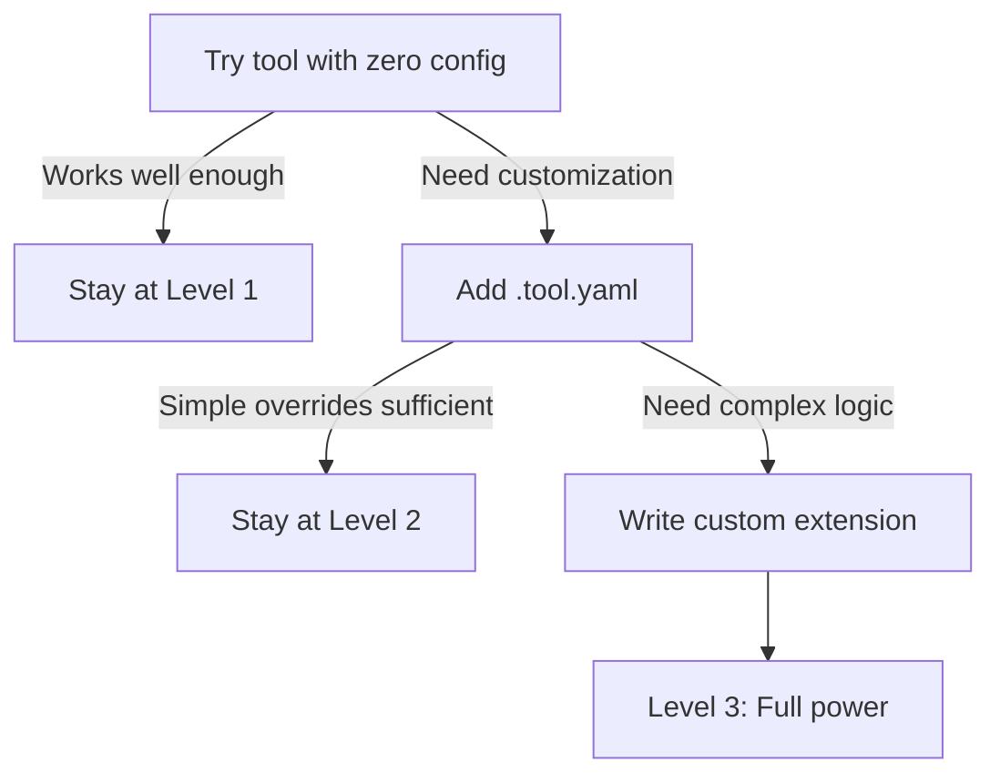

---
beth_topics:
  - progressive-disclosure
  - configuration
  - reveal
  - design-patterns
related_docs:
  - PROGRESSIVE_DISCLOSURE_GUIDE.md
  - CONFIGURATION_AS_SEMANTIC_CONTRACT.md
status: published
date: 2025-12-22
---

# Progressive Configuration Pattern

**Summary:** Most tools force binary choice: zero configuration OR configure everything. The Progressive Configuration Pattern offers a third way—**complexity that scales with project needs** through three levels: intelligent defaults, project overrides, and custom extensions.

---

## The Problem

### Binary Configuration Trap

**Option A: Zero Configuration**
- ✅ Simple to start
- ✅ Low barrier to entry
- ❌ No project-specific customization
- ❌ Breaks down as complexity scales
- ❌ Forces "eject" when limits hit (React CRA pattern)

**Option B: Configure Everything**
- ✅ Full control
- ✅ Handles complex projects
- ❌ Overwhelming for beginners
- ❌ Configuration becomes second codebase
- ❌ High maintenance burden

**The gap:** No middle path for **gradual complexity adoption**.

---

## The Pattern: Three Levels

### Level 1: Intelligent Defaults (Zero Config)

**Principle:** Tool works out-of-the-box with sensible behavior.

**Example (Reveal):**
```bash
reveal src/app.py              # Works immediately
reveal src/ --check            # Quality checks with built-in rules
```

**Design criteria for defaults:**
- ✅ Cover 80% of common use cases
- ✅ Based on industry best practices
- ✅ Safe to run without configuration
- ✅ Fail gracefully when defaults don't fit

**When to stay at Level 1:**
- Simple projects (< 10 files, single developer)
- Standard conventions (follow framework defaults)
- No custom architecture

### Level 2: Project Overrides (Team Config)

**Principle:** Declare project-specific semantics in version-controlled config.

**Example (Reveal):**
```yaml
# .reveal.yaml - Project-specific rules
imports:
  ignore_unused:
    - "**/tests/fixtures/**"     # Test fixtures often unused

architecture:
  layers:
    - name: routes
      path: app/routes/**
      cannot_import: [repositories/**]

quality:
  max_function_lines: 100
```

**Design criteria for overrides:**
- ✅ Committed to repository (team-shared)
- ✅ Declarative syntax (YAML/TOML/JSON)
- ✅ Schema-validated (catch errors early)
- ✅ Documented with comments

**When to move to Level 2:**
- Team projects (> 1 developer)
- Custom architecture (layer boundaries)
- Domain-specific patterns (e.g., "what code calls Stripe API?")
- Enforcement needed (prevent drift)

### Level 3: Custom Extensions (Domain-Specific)

**Principle:** Extend tool with project/organization-specific logic.

**Example (Reveal):**
```python
# ~/.reveal/rules/stripe_security.py
# Custom rule: Track payment code for security audits
from reveal.rules import Rule

class StripeUsageRule(Rule):
    name = "track-stripe-usage"
    description = "Log all Stripe API calls for audit"

    def check(self, node):
        if self.matches_pattern(node, r"stripe\\..*\\("):
            return self.warning(
                node,
                "Stripe API call detected - ensure PCI compliance"
            )
```

**Design criteria for extensions:**
- ✅ Plugin architecture (drop files in directory)
- ✅ Zero registration (auto-discovered)
- ✅ Same API as built-in rules
- ✅ Full language power when needed

**When to move to Level 3:**
- Organization-wide standards (beyond single project)
- Highly domain-specific checks (financial, medical, legal)
- Integration with proprietary tools
- Complex logic that YAML can't express

---

## Implementation Guidelines

### Principle 1: Make Level 1 Genuinely Useful

**Bad default:**
```bash
$ tool src/
Error: No configuration file found. Run 'tool init' first.
```

**Good default:**
```bash
$ tool src/
✓ Analyzed 47 files
  12 functions exceed 100 lines (consider refactoring)
  3 circular dependencies detected

Tip: Create .tool.yaml to customize rules
```

**Key insight:** Level 1 should **solve real problems** without config, not just be a teaser.

### Principle 2: Level 2 Extends, Doesn't Replace

**Bad override behavior:**
```yaml
# .tool.yaml
rules:
  - no-long-functions    # All built-in rules now disabled!
```

**Good override behavior:**
```yaml
# .tool.yaml
quality:
  max_function_lines: 150        # Override specific default

architecture:
  layers: [...]                  # Add project-specific rules
```

**Key insight:** Config should **augment defaults**, not require redefining everything.

### Principle 3: Progressive Complexity Discovery

**Path users should follow:**



**Encourage progression:**
- **Level 1 → 2:** Tool suggests config when defaults don't fit
- **Level 2 → 3:** Documentation shows extension examples
- **Never force:** Each level should be stable stopping point

### Principle 4: Documentation Matches Levels

**Level 1 docs:**
- Quickstart (5 minutes)
- Common commands
- "You probably don't need configuration"

**Level 2 docs:**
- Configuration reference
- Project examples (web app, CLI, library)
- Schema documentation

**Level 3 docs:**
- Extension API
- Plugin development guide
- Advanced patterns

**Anti-pattern:** Showing Level 3 examples in quickstart (overwhelming).

---

## Real-World Examples

### Example 1: Reveal (Code Analysis)

**Level 1: Zero Config**
```bash
reveal src/app.py --check           # Works immediately
```

**Level 2: Project Rules**
```yaml
# .reveal.yaml
architecture:
  layers:
    - name: models
      path: app/models/**
      can_import: [typing, pydantic]
```

**Level 3: Custom Rules**
```python
# ~/.reveal/rules/payment_security.py
# Organization-wide payment code tracking
```

**Result:** Tool scales from solo dev (Level 1) to enterprise org (Level 3).

### Example 2: Prettier (Code Formatting)

**Level 1: Zero Config**
```bash
prettier src/                       # Formats with defaults
```

**Level 2: Project Style**
```json
// .prettierrc
{
  "printWidth": 100,
  "singleQuote": true
}
```

**Level 3: Custom Parser**
```js
// prettier-plugin-custom-lang.js
module.exports = { ... }
```

**Result:** 90% of users stay at Level 1 or 2, advanced users have escape hatch.

### Example 3: ESLint (Linting)

**Critique:** ESLint lacks good Level 1.

**Current reality:**
```bash
$ eslint src/
Error: No ESLint configuration found
```

**Better with Progressive Configuration:**
```bash
$ eslint src/
✓ Using recommended defaults
  12 issues found (8 warnings, 4 errors)

Tip: Create .eslintrc for custom rules
```

**Key insight:** Requiring config file is **anti-pattern** for Level 1.

---

## Connection to Progressive Disclosure

The Progressive Configuration Pattern is **progressive disclosure applied to tool complexity**.

| Progressive Disclosure | Progressive Configuration |
|------------------------|---------------------------|
| **Level 1:** Overview | **Level 1:** Intelligent defaults |
| **Level 2:** Structure | **Level 2:** Project overrides |
| **Level 3:** Detail | **Level 3:** Custom extensions |
| **Principle:** Show detail only when needed | **Principle:** Require config only when needed |
| **Benefit:** 10-150x token reduction | **Benefit:** 10x simpler getting started |

See: [PROGRESSIVE_DISCLOSURE_GUIDE.md](PROGRESSIVE_DISCLOSURE_GUIDE.md)

---

## Anti-Patterns to Avoid

### Anti-Pattern 1: Configuration Required for Basic Use

**Problem:**
```bash
$ tool init                        # Generates 200-line config
$ tool run                         # Now you can use it
```

**Why bad:** Forces users to understand full config before trying tool.

**Fix:** Make Level 1 work without any config.

### Anti-Pattern 2: All-or-Nothing Overrides

**Problem:**
```yaml
# Setting one rule disables all built-in rules
rules:
  - my-custom-rule
```

**Why bad:** Users forced to redefine everything or use all defaults.

**Fix:** Overrides should **extend** defaults, not replace them.

### Anti-Pattern 3: No Clear Level Boundaries

**Problem:**
- Quickstart shows advanced config
- Config reference mixes simple and complex
- No guidance on when to use each level

**Why bad:** Users don't know which level they need.

**Fix:** Explicitly document three levels and when to use each.

### Anti-Pattern 4: Config Complexity Explosion

**Problem:**
```yaml
# 500+ lines of config just to start
framework:
  module_loader:
    plugins:
      transpilers:
        presets: [...]
```

**Why bad:** Config becomes harder to maintain than code.

**Fix:** Keep Level 2 config **declarative and simple**. Push complexity to Level 3 (code).

---

## Design Checklist

When designing progressive configuration for your tool:

**Level 1 (Intelligent Defaults):**
- [ ] Tool runs without any configuration
- [ ] Defaults solve real problems (not just examples)
- [ ] Sensible error messages when defaults don't fit
- [ ] Suggest configuration when appropriate

**Level 2 (Project Overrides):**
- [ ] Declarative format (YAML/TOML/JSON)
- [ ] Schema validation with clear errors
- [ ] Overrides extend defaults (don't replace)
- [ ] Committed to version control
- [ ] Documented with comments and examples

**Level 3 (Custom Extensions):**
- [ ] Plugin architecture (auto-discovered)
- [ ] Same API as built-in features
- [ ] Full language power (not limited DSL)
- [ ] Optional (Level 2 should be sufficient for most)

**Documentation:**
- [ ] Quickstart shows Level 1 (zero config)
- [ ] Tutorial shows Level 2 (project config)
- [ ] Advanced guide shows Level 3 (extensions)
- [ ] Clear guidance on when to use each level

**User Experience:**
- [ ] New users can start in < 5 minutes (Level 1)
- [ ] Teams can customize in < 30 minutes (Level 2)
- [ ] Enterprises can extend in < 4 hours (Level 3)
- [ ] Each level is stable stopping point

---

## Measuring Success

### Adoption Metrics

**Level 1 success:**
- % of users who never create config file
- Time to first successful run (target: < 2 minutes)
- Default rule violation rate (target: < 5% false positives)

**Level 2 success:**
- % of teams with custom config (target: 30-50%)
- Average config file size (target: < 50 lines)
- Config schema validation error rate (target: < 1%)

**Level 3 success:**
- % of organizations with custom extensions (target: < 10%)
- Extension API documentation page views
- Custom extension lines of code vs config YAML ratio

### User Feedback Signals

**Positive signals:**
- "Just works out of the box"
- "Added one line to config, solved my problem"
- "Love that I can extend it when needed"

**Negative signals:**
- "Required 2 hours of config before first run"
- "Had to copy 200 lines from example config"
- "Can't do X without writing plugin"

---

## Future Research

**Open questions:**

1. **Optimal default selection:**
   - How to choose defaults that work for 80% without alienating 20%?
   - Can tools learn better defaults from usage patterns?

2. **Config migration:**
   - How to evolve config schema without breaking existing configs?
   - Automatic migration scripts vs manual updates?

3. **Level 2/3 boundary:**
   - When should complexity move from YAML to code?
   - Can DSLs bridge the gap?

4. **Multi-project config:**
   - Monorepo with multiple projects sharing config?
   - Organization-wide defaults?

5. **AI-assisted configuration:**
   - Can agents suggest config based on codebase analysis?
   - "Looks like you're using FastAPI, here's recommended config"

---

## Conclusion

**The Progressive Configuration Pattern solves the binary choice problem:**

❌ **Old way:** Zero config OR configure everything
✅ **Progressive way:** Intelligent defaults → project overrides → custom extensions

**Key benefits:**
- ✅ Low barrier to entry (Level 1 works immediately)
- ✅ Scales with complexity (add config only when needed)
- ✅ No artificial limits (Level 3 provides escape hatch)
- ✅ Clear progression path (documentation matches levels)

**Implementation:**
- Make Level 1 genuinely useful (not just teaser)
- Level 2 extends defaults (doesn't replace)
- Level 3 provides full power (when YAML isn't enough)
- Document each level separately

**Connection to SIL:**
- Applies progressive disclosure to tool complexity
- Demonstrates "Structure Before Heuristics" (defaults are structural, not guesses)
- Supports agent workflows (agents can start with Level 1, add config as needed)

**Adoption:** Reveal v0.26+ implements this pattern for code analysis and architecture validation.

---

## References

**Related SIL Documents:**
- [Progressive Disclosure Guide](PROGRESSIVE_DISCLOSURE_GUIDE.md)
- [Configuration as Semantic Contract](CONFIGURATION_AS_SEMANTIC_CONTRACT.md)
- [Architectural Principles](/foundations/architectural-principles.md)

**Real-World Examples:**
- Reveal: Full three-level implementation
- Prettier: Strong Level 1, simple Level 2
- ESLint: Weak Level 1 (requires config)
- Next.js: Good Level 1, optional Level 2

**External References:**
- "Convention over Configuration" (Ruby on Rails pattern)
- "Sensible Defaults" (Python philosophy)
- "Progressive Enhancement" (web development pattern)

---

**Status:** Published
**Date:** 2025-12-22
**Version:** 1.0
**Author:** Semantic Infrastructure Lab
